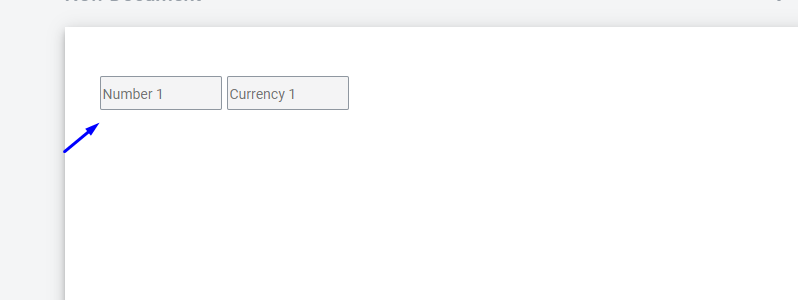
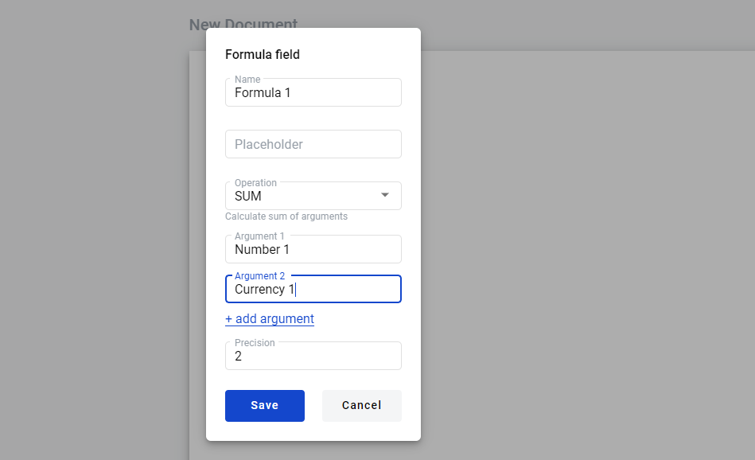
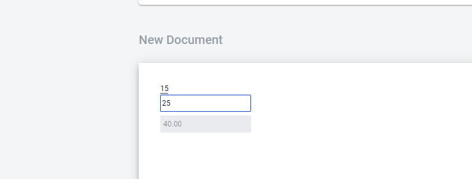
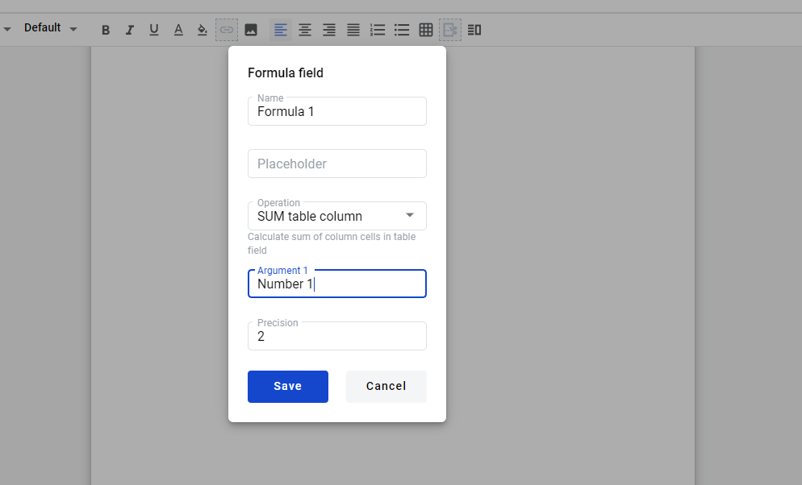
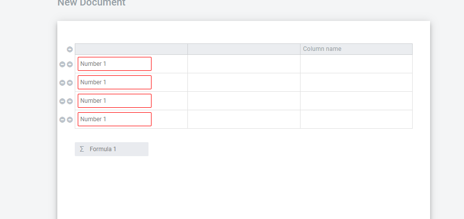
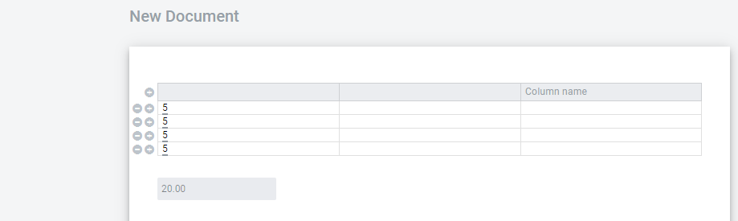
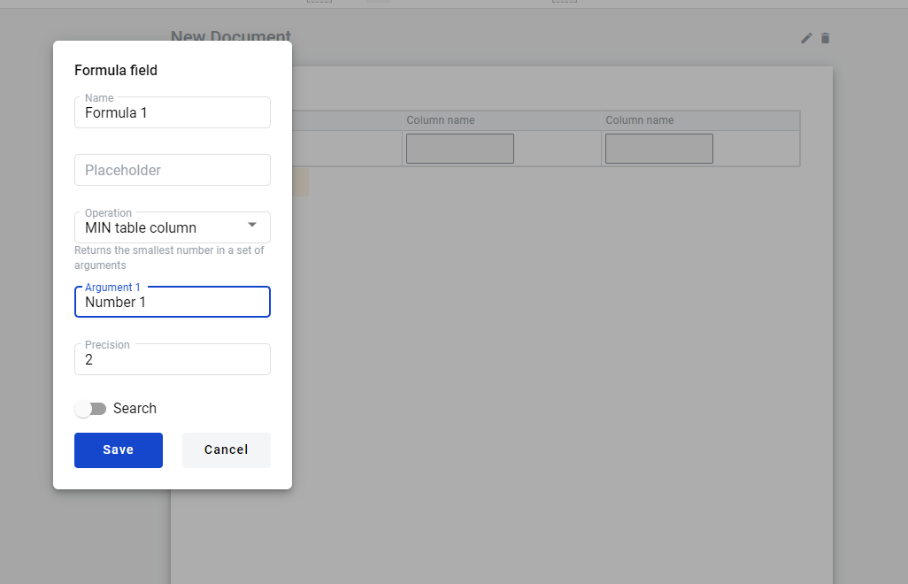
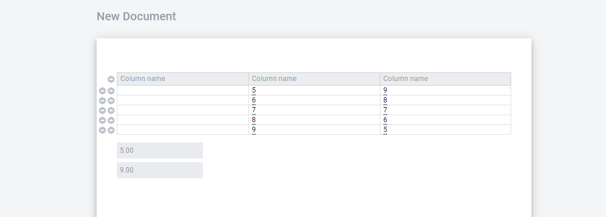

=============
Formula Field
=============

.. toctree::

Dynamic Formula field has been added to the template page.
There are functions available in the formula box:

1. SUM - argument summation
2. PRODUCT - multiplication of arguments
3. SUBTRACT - returns the difference of arguments
4. DIVIDE - returns the quotient of arguments

functions can only be applied to a field within a table:

1. SUM table column - summing arguments in a dynamic table column
2. COUNTA table column -returns  number of non-empty cells in a column
3. MIN table column - returns the smallest number in a set of arguments
4. MAX table column - returns the largest value in a set of arguments

arguments can be: numeric, currency, dictionary field, lookup, duplicate, formula field and also the user can enter his own value

Create Formula Field
====================

1. Create Template

2. Go to template, create number field and currency field

3. Select formula field

.. image:: pic_formula/Screenshot_11.png
   :width: 600
   :align: center

4. Select the SUM function, in the arguments field, select a numeric and currency fields

4. Save the formula field. Fill in the main fields of  template. Create a draft envelope

5. Filling numeric and currency field

.. image:: pic_formula/Screenshot_3.png
   :width: 600
   :align: center

6.After filling fields, pay attention to  formula field

7. Send envelope

In order to apply the SUM table column function, you must repeat the following steps:

1. Create Template

2. Go to template create  dynamic table, added numeric field to dynamic table

.. image:: pic_formula/Screenshot_6.png
   :width: 600
   :align: center

3. Select formula field,select the SUM table column, in the arguments field, select a numeric field.

4. Save the formula field. Fill in the main fields of  template. Create a draft envelope

5. Add two rows to table, filling numeric field

6. After filling fields, pay attention to formula field

7. Send envelope

!!!For users who will work through integrations, it is necessary to understand that the SUM table column function contains one attribute,
   and looks like this: <formula precision="2" name="total">SUM({rowTotal})</formula>, but the SUM function has two arguments

   .. image:: pic_formula/Screenshot_10.png
      :width: 600
      :align: center

In order to apply the COUNTA table column function, you must repeat the following steps:

1. Create Template
2. Create dynamic table field
3. Add number field in table
4. Select formula field, add argument

.. image:: pic_formula/Screenshot_56.png
   :width: 600
   :align: center

5. Fill in the main fields of template
6. Create envelope
7. Add rows to table. and fill number fields

.. image:: pic_formula/Screenshot_01.png
   :width: 600
   :align: center

8. COUNTA table column function counts the number of non-empty cells in a column

In order to apply the MIN/MAX table column function, you must repeat the following steps:

1. Create Template
2. Create dynamic table field
3. Add number field and currency field in table
4. Select MIN table column formula, add argument

5. Select MAX table column function, add argument

.. image:: pic_formula/Screenshot_03.png
   :width: 600
   :align: center

6. Fill in the main fields of template
7. Create envelope
8. Add rows to table and fill in number fields

10. As a result, the field MIN table column formula - shows the minimum value and MAX table column function -  the maximum.