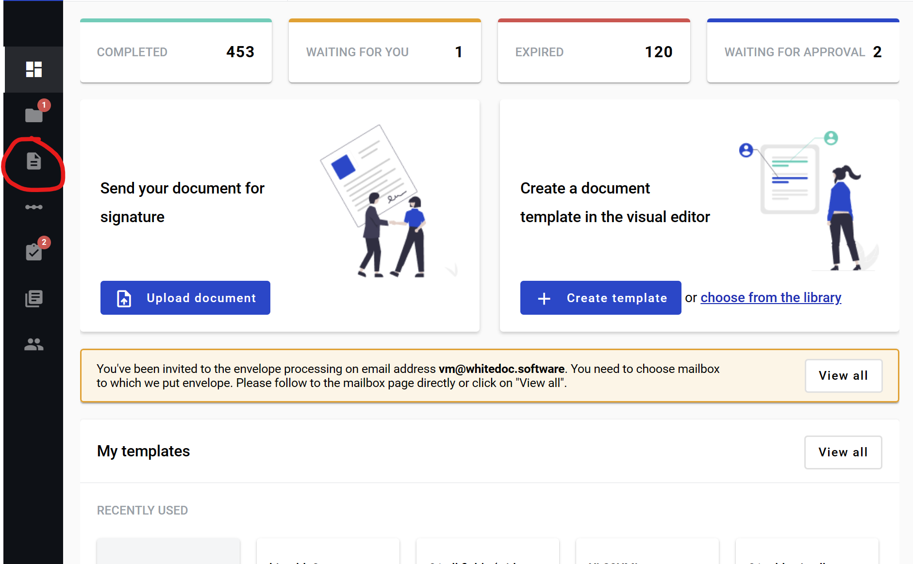

=================
External Document
=================

.. toctree::

What is external document?
==========================

It is a field which allows to create a form for upload of an external file of various formats in the envelope created from template. It can be signed with an EDS or e-ink signature later by envelope processing flow participants.

How to add an external document to template?
============================================

1. Navigate to ../template/list?s=mailbox or press the button "Templates" on the left sidebar

2. Click on the "New Template" button

.. image:: pic_externalDocument/newTemplateButtonTemplates.png
   :width: 600
   :align: center

3. Alternatively, you can click "Create template" or "New From Blanc" button on the dashboard

.. image:: pic_externalDocument/newTemplateButtonDashboard.png
   :width: 600
   :align: center

4. Click on the "Add new document" button on the left side (menu with it can be collapsed depending on your monitor resolution, just expand it by clicking "Documents" icon)
5. Click on "External" button. After this document will appear under default first structured document (assigned to Sender by default)
6. In the template editor you can edit document properties, such as role, optionality or allowed file extensions:

* All - .pdf, .doc, .docx, .xls, .xlsx, .xlsm, .xml, .dbf, .txt, .rtf, .csv, .xps, .eml, .msg, .emlx, .rpmsg, .png, .jpg, .jpeg, .tiff, .tif, .zip, .7z, .rar
* File - .pdf, .doc, .docx, .xls, .xlsx, .xlsm, .xml, .dbf, .txt, .rtf, .csv, .xps, .eml, .msg, .emlx, .rpmsg
* PDF document - .pdf
* Image - .png, .jpg, .jpeg, .tiff, .tif
* Archive - .zip, .7z, .rar

6. You also can add EDS and e-ink fields to such document

How to clone external document?
===============================

1. Click "More" button in the right upper corner of the document
2. Click "Clone" button in the menu

How to delete external document?
================================

1. Click "More" button in the right upper corner of the document
2. Click "Delete" button in the menu