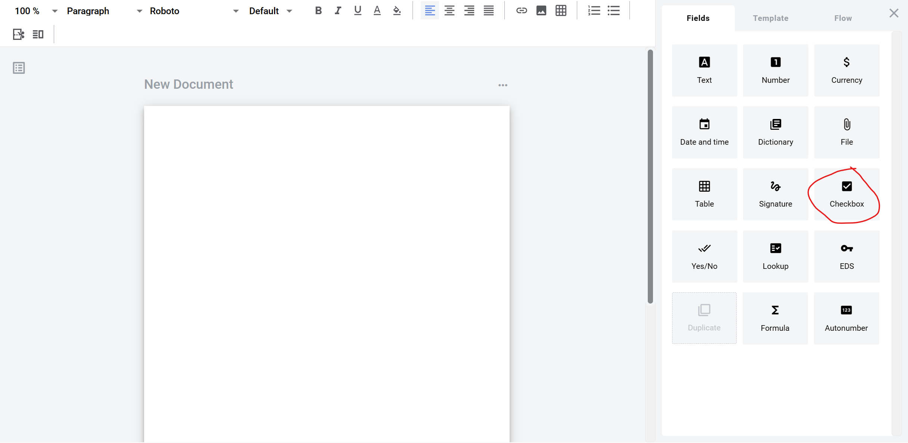

==============
Checkbox field
==============

Checkbox is a field which allows you to create a dynamic checkbox. It can be checked or left unchecked by participants of the envelope processing flow.

How to add checkbox field to the document
=========================================

1. To add field to the document, use one of field adding methods with field icon in the Fields tab of template editor menu

2. Field creation form will appear, where you should set field attributes

.. image:: pic_checkbox/checkboxModal.png
   :width: 600
   :align: center

3. Name - this is a name of a field
4. Role name - this is a role which will be assgined to fill this field
5. Search - this attribute specifies if this field should be eligible for mailbox page search
6. Required - this attribute specifies if this checkbox is mandatory to check

When all attributes are set, you can click Save button and field will be added. You can click field to see its properties and update them. Also you can delete the field in same menu.

.. image:: pic_checkbox/checkboxProperties.png
   :width: 600
   :align: center