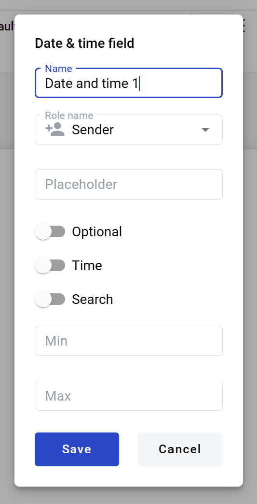

===================
Date and time field
===================

Date and time field allows you to create calendar selector which will be filled by participants of the envelope processing flow. It can be added to structured and PDF documents.

How to add date and time field to template
==========================================

1. To add field to the document, use one of field adding methods with field icon in the Fields tab of template editor menu

.. image:: pic_dateAndTime/dateAndTimeIcon.png
   :width: 600
   :align: center

2. Field creation form will appear, where you should set field attributes

3. Name - this is a name of a field
4. Role name - this is a role which will be assgined to fill this field
5. Placeholder - this text will be shown in the input box before anything is filled in (can be left empty, field name will be used instead)
6. Optional - this attribute specifies if this field is mandatory to fill
7. Time - this attribute specifies if time selector will be added to calendar
8. Search - this attribute specifies if this field should be eligible for mailbox page search
9. Min - minimal timestamp accepted by field (no limit is applied if left empty)
10. Max - maximal timestamp accepted by field (no limit is applied if left empty)

.. note:: Min and max fields only accept integers. They specify boundary dates offset in days. E.g. if min is 0 and max is 1, date interval from today to tomorrow will be available. If min is -1 and max is 0 then range from yesterday to today will be available. If min and max are both same, then only specified day will be available.

When all attributes are set, you can click Save button and field will be added. You can click field to see its properties and update them. Also you can delete the field in same menu.

.. image:: pic_dateAndTime/dateAndTimeProperties.png
   :width: 600
   :align: center