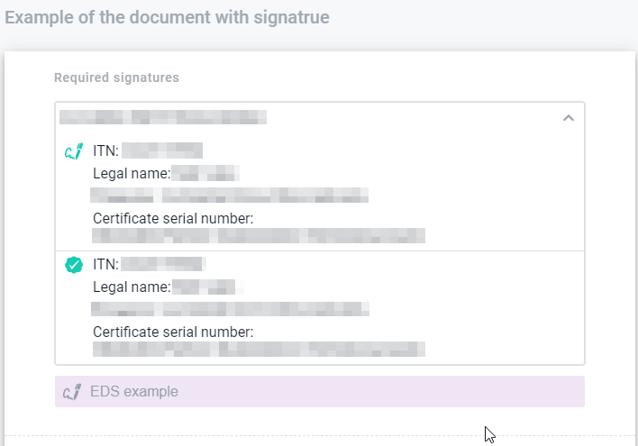

.. _electronic-signature:

================================
Electronic signature on envelope
================================

.. toctree::

On the envelope you can set electronic signature and stamp to the document if needed. You can add electronic signature using key with your electronic signature. You sign the two documents type: pdf (human readable format) and xml (structured data of the document). You can download the signature and signed documents.

How to sign the document
========================

If you want to sign document you have to have at least one signature field in the document. How to add electronic signature to the document you can read the topic "Electronic signature on template". To sign the the document you have to do the following:

1. Click on the button of the electronic signature in "required signatures" block (or click on the "pencil" button to follow to the field and click on it)

.. image:: pic_digitalSignature/signatureOneEnvelopeMyTurn.png
   :width: 400
   :align: center

2. As soon as you click on, the modal window opens. In this modal window you will see the instruction related to sign process

.. image:: pic_digitalSignature/chooseKeyWindow.png
   :width: 400
   :align: center

3. Click on the button "Choose key" and select your type of electronic signature which you want to apply. If sender specify "Qualified" attribute to electronic signature field you could apply only qualified electronic signature
4. Read certificates from your key (`Advanced electronic signature <advancedElectronicSignature.html>`_ , `Qualified electronic signature <qualifiedElectronicSignature.html>`_)
5. Press on the button "Next" to watch the information related to documents which you're going to sign (pdf (human readable format) and xml (structured data of the document))

.. image:: pic_digitalSignature/theListOfTheDocuments.png
   :width: 400
   :align: center

6. Click on "Next" button you will see the results of the signing the documents (if documents sing successfully you will see success message if not error message)

.. image:: pic_digitalSignature/successSignedDoc.png
   :width: 400
   :align: center

7. After step above modal window closes and on the envelope in "required signature" block you will see that field changes and it shows information related to whom signed the document. Also you can click on it and detailed information opens. In the detailed information shows who and when sign the document

8. To finish the signing documents you have to sign all documents related to your role and press on the button "Send"

.. image:: pic_digitalSignature/signedDocument.png
   :width: 400
   :align: center

9. Also, you can set a stamp to the document if needed. You may do this just press on the link "I want to choose stamp" on the second step of the document signing

How to sign all documents in envelope
=====================================

You can sign all documents in envelope for one time. To do that follow the instructions above until you get step with documents list to sign. If you will have more than one document to sing option "Sign all documents" appears. Select "Sign all documents" option and all documents from particular envelope which you're able to sign will be shown to you.

.. image:: pic_digitalSignature/signature3-2.png
   :width: 400
   :align: center

If you continue signing procedure you will sign all documents from the list.

.. note:: Don't forget to send signed envelope after last step, or signature will be lost.

How to download the signed data
===============================

You can download the signature(s) of the document(s) when all participant with role "Signer". You're able to download particular document with signatures or whole envelope with all the documents inside and all signatures inside. To do this, just:

1. Check that envelope completed
2. Open envelope
3. Click on respective "download" button in the header, to download the full envelope with all signed documents
4. Or click on respective "download" button ahead document name and you will download particular document with all signatures

As soon as you click on the document download button archive with the documents will be uploaded.

How to check validity of the signatures
=======================================

To check the validity of the signatures that roles did you have to do the following:

1. Download the archive with signatures and document(s)
2. Follow the link https://czo.gov.ua/verify
3. Select files .p7s and document you have signed
4. Click on "Check" button

After validation completed you will see results.

.. include:: advancedElectronicSignature.rst
.. include:: qualifiedElectronicSignature.rst
.. include:: TINSignature.rst
.. include:: signatureCommonErrors.rst
.. include:: smartId.rst