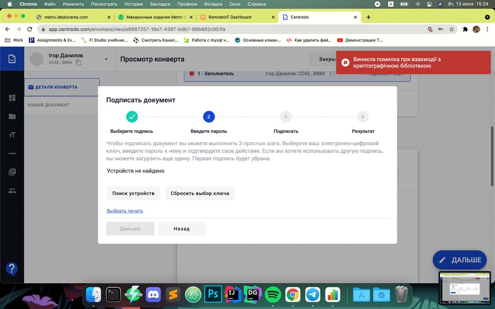

Signature common errors and solutions
=====================================
Sometimes the user may have problems with the selection of the Qualification Signature. Most often this is due to updates to the signature library, or incorrect configuration of the software package related to reading signatures.

1. If you are trying to select a signature, and you receive an error "There was a problem while interacting with the cryptographic library", as shown in the figure below, make sure that you have gone through all the steps for installing the library on your PC, which you can find by the :ref:`QUALIFIED-ELECTRONIC-SIGNATURE <qualified-electronic-signature>`, and try again.

2. Periodically, the cryptographic library is updated, so the user may face a situation when his version of the library is outdated, then he will receive the message "The installed version of the library is not supported". In this case, the user needs to update (install the latest library version) on his PC. Follow this steps to update / reinstall library:  :ref:`QUALIFIED-ELECTRONIC-SIGNATURE <qualified-electronic-signature>`.

.. image:: pic_common_error/crypto-lib-err-2.png
   :width: 400
   :align: center