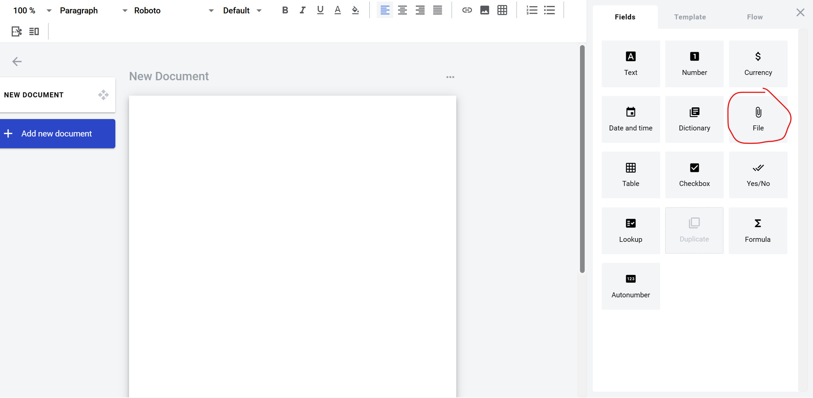
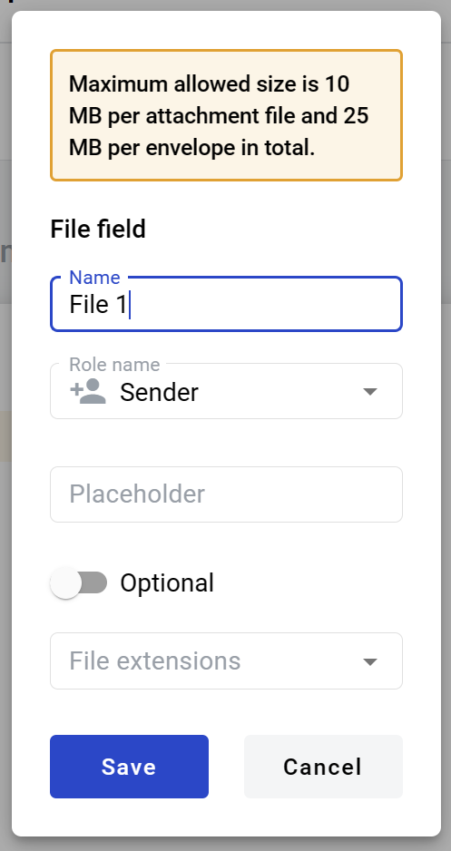
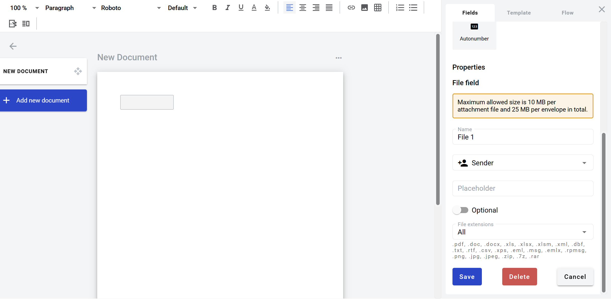

==========
File field
==========

File field allows you to create an upload box for external files. Participants of the envelope processing flow will be able to upload and download a file with it.

How to add file field to template
=================================

1. To add field to the document, use one of field adding methods with field icon in the Fields tab of template editor menu

2. Field creation form will appear, where you should set field attributes

3. Name - this is a name of a field
4. Role name - this is a role which will be assgined to fill this field
5. Placeholder - this text will be shown in the input box before anything is filled in (can be left empty, field name will be used instead)
6. Optional - this attribute specifies if this field is mandatory to fill
7. File extension - this attribute specifies file extensions which will be allowed by field. Next options are available:
   1. All: .pdf, .doc, .docx, .xls, .xlsx, .xlsm, .xml, .dbf, .txt, .rtf, .csv, .xps, .eml, .msg, .emlx, .rpmsg, .png, .jpg, .jpeg, .zip, .7z, .rar
   2. File: .pdf, .doc, .docx, .xls, .xlsx, .xlsm, .xml, .dbf, .txt, .rtf, .csv, .xps, .eml, .msg, .emlx, .rpmsg 
   3. PDF Document: .pdf
   4. Image: .png, .jpg, .jpeg
   5. Archive: .zip, .7z, .rar

When all attributes are set, you can click Save button and field will be added. You can click field to see its properties and update them. Also you can delete the field in same menu.

File field in the envelope
==========================

To upload a file to the attachment field you should click on it, and select a file in opened file explorer window. You can upload only one file to one attachment field. Maximum file size and size of all uploaded files in one envelope is set on instance but typical default value is 5MB and 25MB respectively.