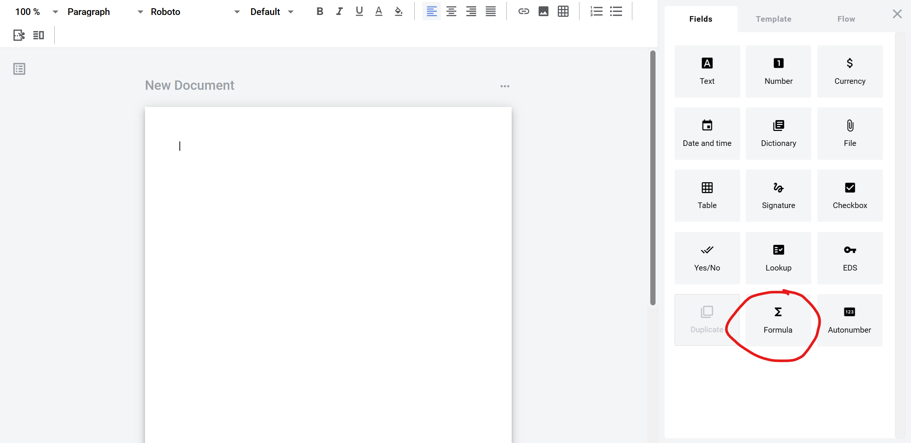
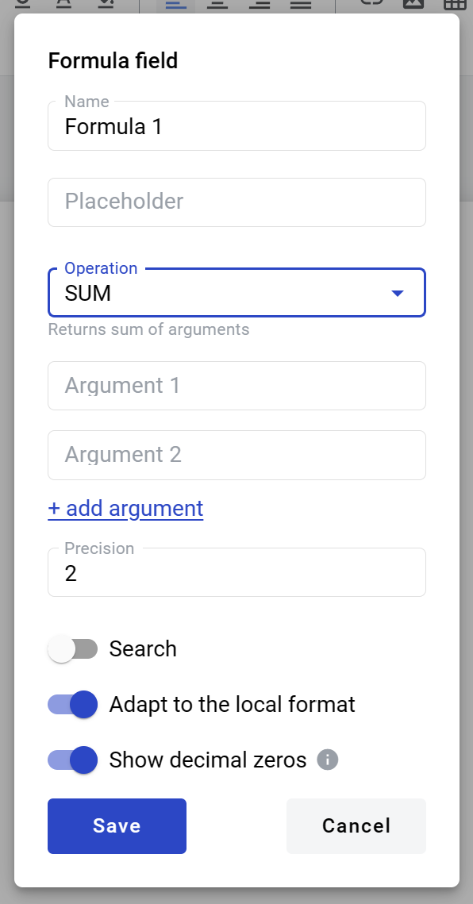
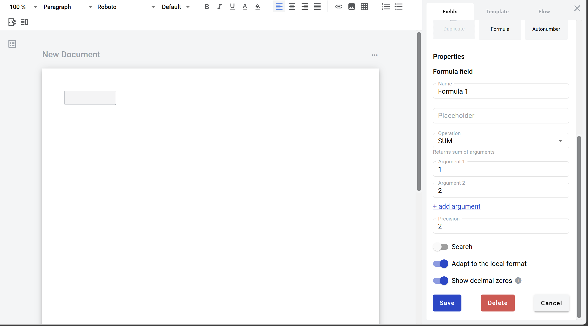

=============
Formula field
=============

Formula field allows you to create static box which will show results of calculations where other dynamic fields (and static values) can be used as arguments. It can be added to structured and PDF documents.

Following operations are available for any argument fields in the document:

1. **SUM** - returns arguments sum
2. **PRODUCT** - returns result of arguments multiplication
3. **SUBTRACT** - returns result of arguments substraction
4. **DIVIDE** - returns result of arguments division

Following operations can only be performed with a field inside a dynamic table (to specify table column for calculations select a field from this column):

5. **SUM table column** - returns table column cell values sum
6. **COUNTA table column** - returns number of non-empty cells in a column
7. **MIN table column** - returns the smallest value in table column
8. **MAX table column** - returns the largest value in table column

Next fields can be used as arguments in formulas: Number, Currency, Dictionary, Lookup, Duplicate and other Formula.

.. note:: If you use Dictionary, Lookup or their`s Duplicates, values will be parsed as numbers. All symbols except numbers and last period will be ignored in calculations. If there are several periods, only last one will be considered as decimal place separator, rest will ignored. This means that if you will pass "Abc@/.1.1.1" and "Abc@/.1.1.1" as arguments into SUM formula, it will return "22.2" as a result.

How to add formula field to template
====================================

1. To add field to the document, use one of field adding methods with field icon in the Fields tab of template editor menu

2. Field creation form will appear, where you should set field attributes

3. Name - this is a name of a field
4. Placeholder - this text will be shown in the input box before anything is filled in (can be left empty, field name will be used instead)
5. Operation - type of operation which will be performed with arguments
6. Argument (1, 2 and so on, will appear after operation is selected) - arguments which will be used for calculation. They are parsed in strict order from first to last. If you will click on argument input, dropdown selector with available fields will appear. Static values can be typed in directly as well.

.. note:: You can add more then 2 default arguments by clicking "+ add argument" link

7. Precision - number of decimal places allowed in field (no limit is applied if left empty)

.. note:: If value inside the field has more decimal places then allowed by precision attribute, all extra places will be trimmed. No rounding will be applied. E.g. if original value is 1.99 it will be changed to 1.9 if precision is set to 1 and will be changed to 1 if precision is set to 0.

8. Search - this attribute specifies if this field should be eligible for mailbox page search
9. Adapt to the local format - this attribute specifies if numbers will be formatted according to regional standard

.. note:: Numbers in envelope view will be formatted according to standard of a region which is selected on User profile page. You can see formatting example under region selector on that page. Numbers in printable versions of the documents will always be formatted according to platform region standard.

10. Increase decimal places - if enabled, zeroes will be added to fill all empty decimal places of field value

When all attributes are set, you can click Save button and field will be added. You can click field to see its properties and update them. Also you can delete the field in same menu.

