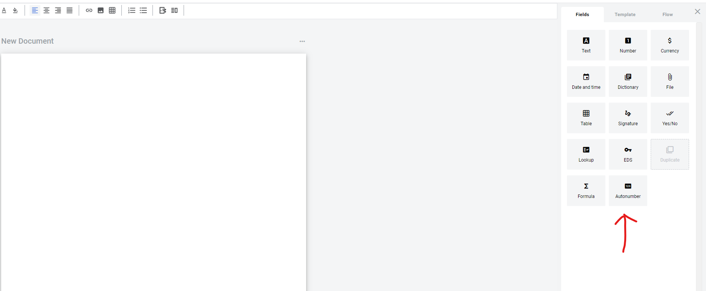
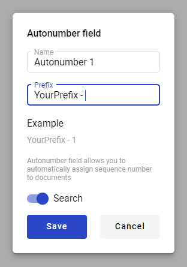
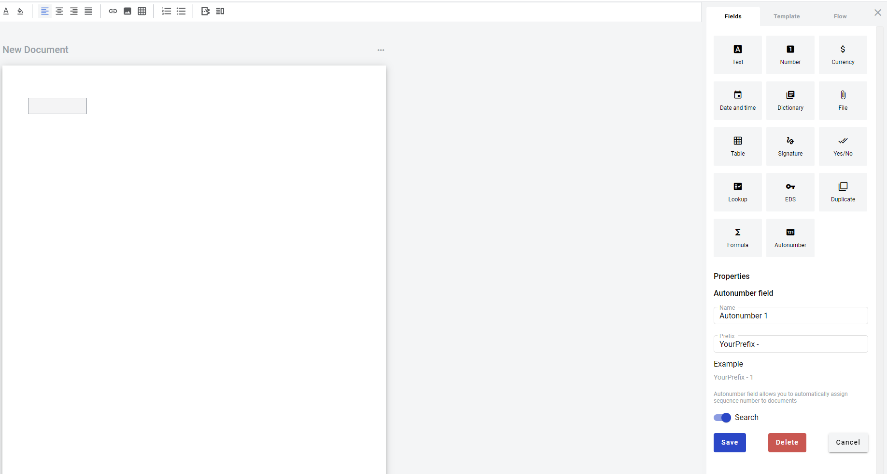

================
Autonumber Field
================

.. toctree::

Autonumber field allows you to add a sequence number which will automatically increment on each new envelope created from a template. It does not need to be filled manually. Numbering for each field will never restart, even if field was removed and then added again with same field name. For different field names there will be separate counters. Numbers of deleted draft also will not be reused.

To add autonumber field you should place a cursor in the document and click on Autonumber field button, or drag it over the document.

Modal window with properties of the field will appear.

1. Name - this is a name of a field

2. Prefix - this is text that will be appended to sequence number. You can enter up to 15 characters. Example will be shown in same modal window

3. Search - this attribute specifies if this field should be eligible for mailbox page search

When attributres are set you can click Save button and field will be added. You can click filed to see its properties and update them. Also you can delete the field in same menu.

