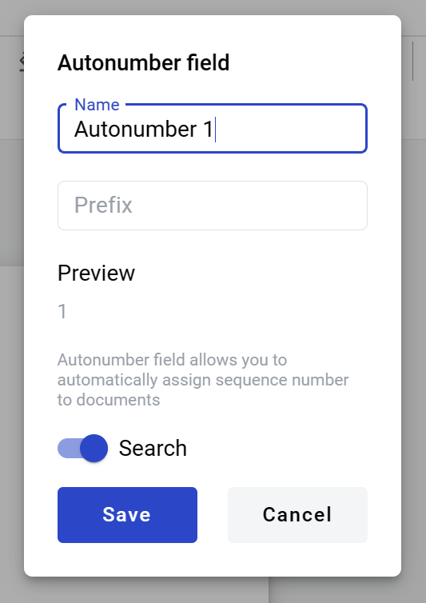

================
Autonumber field
================

Autonumber field allows you to create static box which will indicate a number of envelope created from this template. It will increment by one with every new envelope automatically. It can be added to structured and PDF documents.

How to add autonumber field to template
=======================================

1. To add field to structured document, place text cursor where you want field to be added and click its button (alternatively it can be placed via drag & drop)

.. image:: pic_autonumber/autonumberIcon.png
   :width: 600
   :align: center

2. To add field to PDF document, drag & drop it to desired place in the document. It can be moved around and resized by lower left corner afterwards

.. image:: pic_autonumber/autonumberPDF.png
   :width: 600
   :align: center

3. Field creation form will appear, where you should set field attributes

4. Name - this is a name of a field
5. Prefix - this attribute indicates a string value which will be appended to the number

When all attributes are set, you can click Save button and field will be added. You can click field to see its properties and update them. Also you can delete the field in same menu.

.. image:: pic_autonumber/autonumberStructured.png
   :width: 600
   :align: center