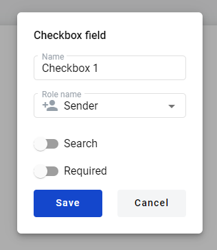
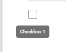

==============
Checkbox field
==============

.. toctree::

Checkbox is a field that can be checked or left unchecked in the envelope.

Checkbox field addition to the document
=======================================

To add Checkbox field to the document drag and drop it to the document from the fields bar. Fill required fields and select required data (name, role, search and required attributes).

Checkbox field in the envelope
==============================
In the envelope Checkbox field looks like regular checkbox. It has grey borders by default or red borders if Required  attribute was enabled.

If checkbox was marked as required, envelope can not be sent until checkbox is checked. If required attribute was not enabled checkbox remains optional.