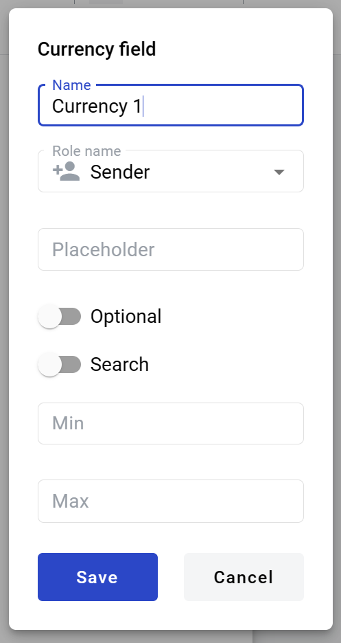
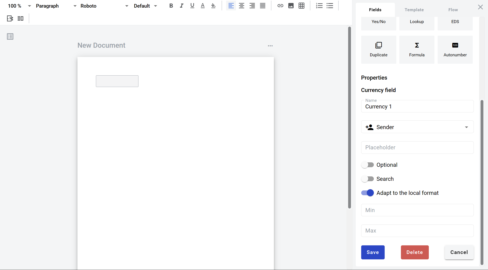

==============
Currency field
==============

Currency field allows you to create dynamic input box which will be filled by participants of the envelope processing flow. It can be added to structured and PDF documents.

How to add currency field to template
=====================================

1. To add field to structured document, place text cursor where you want field to be added and click its button (alternatively it can be placed via drag & drop)

.. image:: pic_currency/currencyIcon.png
   :width: 600
   :align: center

2. To add field to PDF document, drag & drop it to desired place in the document. It can be moved around and resized by lower left corner afterwards

.. image:: pic_currency/currencyPDF.png
   :width: 600
   :align: center

3. Field creation form will appear, where you should set field attributes

4. Name - this is a name of a field
5. Role name - this is a role which will be assgined to fill this field
6. Placeholder - this text will be shown in the input box before anything is filled in (can be left empty, field name will be used instead)
7. Optional - this attribute specifies if this field is mandatory to fill
8. Search - this attribute specifies if this field should be eligible for mailbox page search
9. Adapt to the local format - this attribute specifies if numbers will be formatted according to regional standard

.. note:: Numbers in envelope view will be formatted according to standard of a region which is selected on User profile page. You can see formatting example under region selector on that page. Numbers in printable versions of the documents will always be formatted according to platform region standard.

10. Min - minimal value allowed in field (no limit is applied if left empty)
11. Max - maximal value allowed in field (no limit is applied if left empty)

.. warning:: Maximum allowed character count for currency field is 15 (according to `IEEE 754 <http://https://en.wikipedia.org/wiki/IEEE_754>`_). Please note this includes decimal places. This means that if you insert a value 999999999999999 or more characters, it will be converted to 9999999999999.00.

When all attributes are set, you can click Save button and field will be added. You can click field to see its properties and update them. Also you can delete the field in same menu.

