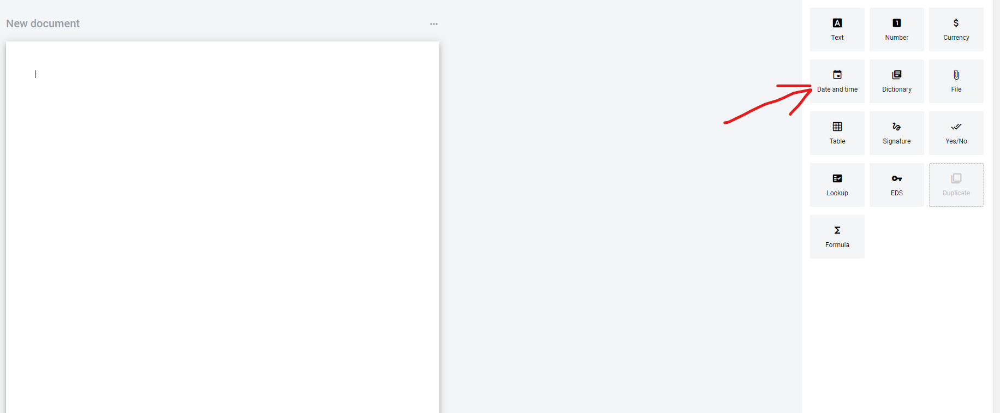
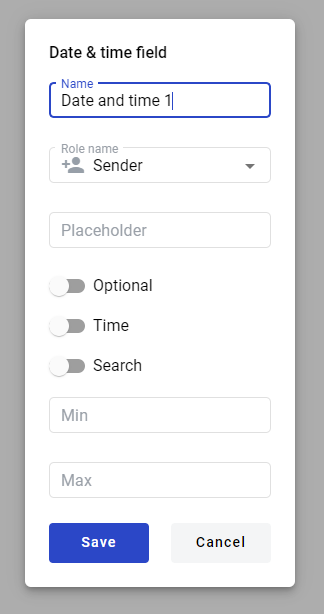
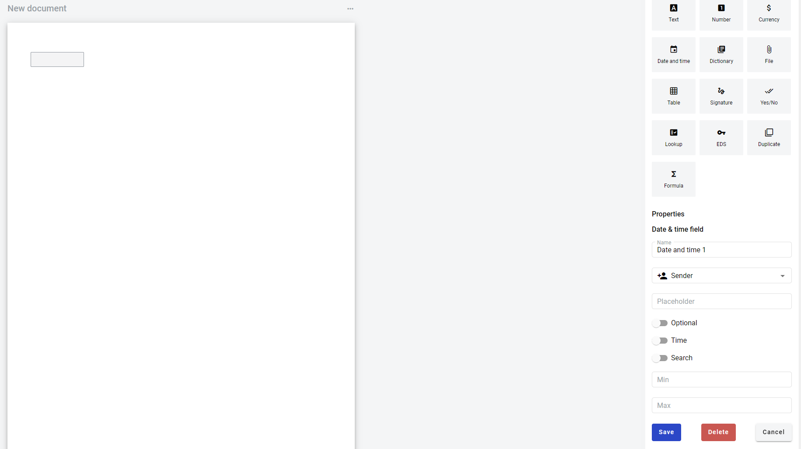

===================
Date and time field
===================

.. toctree::

Date and time field allows you to create date and time selector which will be filled by participants of the envelope processing flow. To add text field you should place a cursor in the document and click on Text field button, or drag it over the document.

You will see modal window with properties of Date and time field you are adding.

1. Name - this is a name of a field
2. Role name - this is a role which will be assgined to fill this field
3. Placeholder - this text will be shown in the text box before anything is filled in (can be left empty)
4. Optional - this attribute specifies if this field is mandatory to fill
5. Time - this attribute specifies if time will be included with date
6. Search - this attribute specifies if this field should be eligible for mailbox page search
7. Min - minimum date (no limit is applied if left empty)
8. Max - maximum date (no limit is applied if left empty)

.. note:: Min and max fields only accept integers. They specify date offset in days. For example if min is 5 and max is 2, then date interval from 5 past days to 2 days in the future can be set. If min is 0 and max is 0 then only current date can be selected.

When attributres are set you can click Save button and field will be added. You can click filed to see its properties and update them. Also you can delete the field in same menu.

