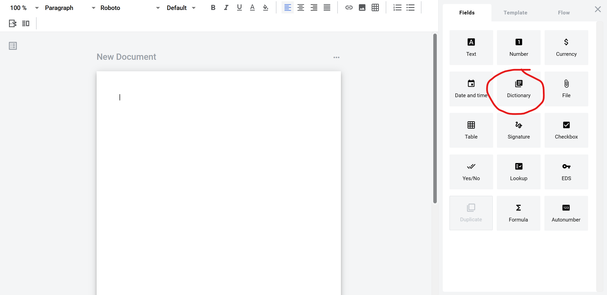
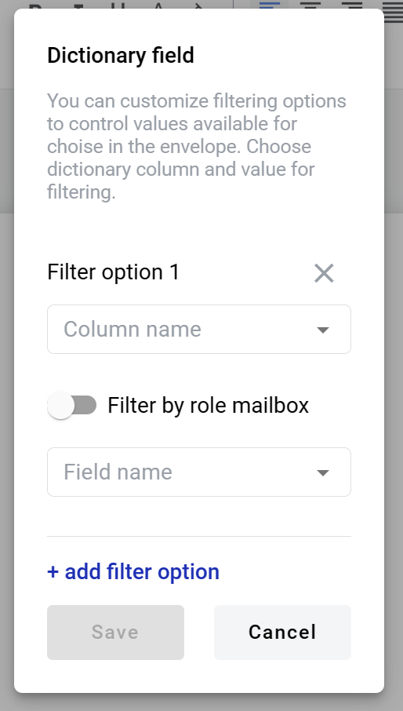
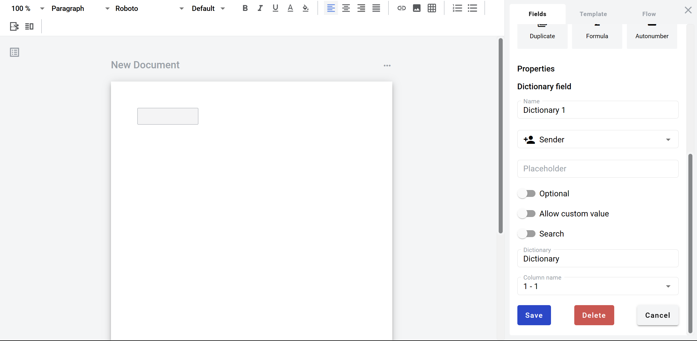

================
Dictionary field
================

Dictionary field allows you to create dropdown selector of records from dictionary (table), e.g. list of employees (First name, last name, age, address).

How to add dictionary field to template
=======================================

1. To add field to structured document, place text cursor where you want field to be added and click its button (alternatively it can be placed via drag & drop)

2. To add field to PDF document, drag & drop it to desired place in the document. It can be moved around and resized by lower left corner afterwards

.. image:: pic_dictionary/dictionaryPDF.png
   :width: 600
   :align: center

3. Field creation form will appear, where you should set field attributes

.. image:: pic_dictionary/dictionaryModal.png
   :width: 600
   :align: center

4. Name - this is a name of a field
5. Role name - this is a role which will be assgined to fill this field
6. Placeholder - this text will be shown in the input box before anything is filled in (can be left empty, field name will be used instead)
7. Optional - this attribute specifies if this field is mandatory to fill
8. Allow custom values - this attribute specifies if field will allow free text input besides selection from predefined dictionary values
9. Search - this attribute specifies if this field should be eligible for mailbox page search
10. Dictionary - input for desired dictionary selection. Start typing dictionary name and available dictionaries list will appear
11. Column name (appears after dictionary is selected) - dropdown selector of a desired column
12. Filtering (icon in dictionary name field) - opens filtered access options menu. Appears only if filtered access is allowed for selected dictionary

13. Column name - name of a column in a dictionary which will be used for filtering

.. note:: Value from this column will be used to find a matching row in a column selected in dictionary during envelope processing flow.

14. Filter by role mailbox - this attribute specifies if filtering should be applied by role (if enabled) or by field value (if disabled)
15. Field name (changes to role name if previous attribute is enabled) - field which will be used to specify a row by value from column selected in column name (13).

.. note:: If filtering by role is enabled and field becomes role name selector, it selects a role mailbox UUID of which will be used to find a matching row in dictionary. In this case, column with mailbox UUIDs should be selected in column name (13) field for matching.

When all attributes are set, you can click Save button and field will be added. You can click field to see its properties and update them. Also you can delete the field in same menu.

