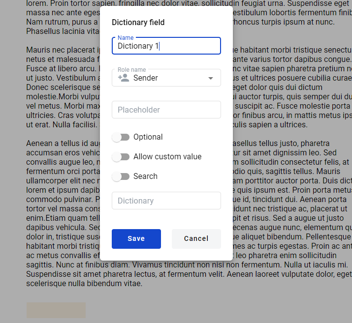
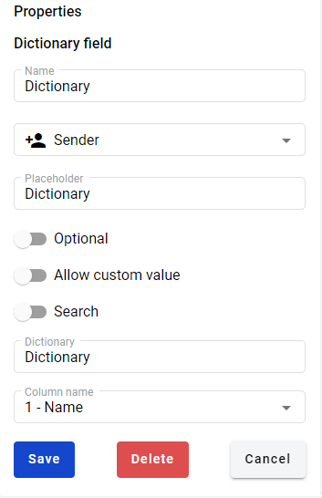

================
Dictionary field
================

.. toctree::

Dictionary is a list of records in a table form, e.g. list of employees (First name, Last name, Age, Address).
Data from dictionary could be used in envelope.

Create Dictionary Field
=======================

1. Navigate to https://staging.whitedoc.space/template/form/editor

2. Drag and drop dictionary field to the document.

3. Next window should appear:

4. Fill the "Name" attribute of the field (should be unique per document).

5. Select a role from "Role name" menu which will be filling this field.

6. Fill the "Placeholder" attribute for this field (not mandatory, if you won't fill this field, name will be used as placeholder).

7. Select "Optional" attribute status for this field. If it is enabled value in the field can be left empty.

8. Select "Allow custom values" attribute status for this field. If it is enabled value in the field can be modified by hand instead of using only predefined values from dictionary.

9. Select "Search" attribute status for this field. If it is enabled value in the field can be used for envelope search in mailbox.

10. Choose "Document" from the list of documents.

11. Choose input dictionary name in "Dictionary" field to select which dictionary will be used.

12. Choose column from "Column name" list (it will appear after selecting a dictionary in previous step) of columns for this field to refer to.

13. Click on "Save" will add new dictionary field.

Edit Dictionary Field
=====================

1. Navigate to https://staging.whitedoc.space/template/form/editor

2. Click on the dictionary field in the document.

3. Edit field form should appear on the right side:

4. Click on "Delete" button will delete field and close edit form.

5. Click on "Cancel" will close edit form.

6. You can change parameters the same way as described in "Create Dictionary Field".

7. Click on "Save" will Save all the changes you made and close edit form.

Dictionary Field in Envelope
============================
User has to select a value from drop-down menu. If "Allow custom values" attribute enabled user can enter custom values.
After value was added to field and processing flow was continued value of dictionary field is blocked. Any updates in dictionary will not apply to this field.
