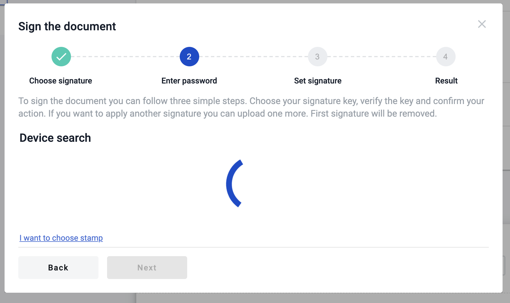

.. _qualified-electronic-signature:

Reading qualified electronic signature
======================================

To use qualified electronic signature you should install special software manually to your PC.

**Installation**

.. warning:: Update your OS and browser to the latest version before proceeding.

1. Download and install crypto library (`MacOS <https://iit.com.ua/download/productfiles/EUSignWebInstall.pkg>`_ , `Windows <https://iit.com.ua/download/productfiles/EUSignWebInstall.exe>`_) to access your qualified keys
2. Add `browser extension <https://chrome.google.com/webstore/detail/%D1%96%D1%96%D1%82-%D0%BA%D0%BE%D1%80%D0%B8%D1%81%D1%82%D1%83%D0%B2%D0%B0%D1%87-%D1%86%D1%81%D0%BA-1-%D0%B1%D1%96%D0%B1%D0%BB/jffafkigfgmjafhpkoibhfefeaebmccg?utm_source=chrome-app-launcher-info-dialog>`_ to access crypto library from browser
3. Reboot your PC

**Reading key**

1. Wait until process of searching devices is finished

2. Select your hardware key and enter the password of the key and click "Read key" button (if you enter the valid password and key is valid you will see sign details and the next form of the modal window, if not you will see the error message)

.. image:: pic_qualifiedSignature/open-device.png
   :width: 400
   :align: center

3. As soon as you enter valid data you will see the information related to key with which you want to sign the document

.. image:: pic_qualifiedSignature/key-info.png
   :width: 400
   :align: center

Reading electronic signature using bluetooth device
===================================================

To use qualified electronic signature which located on bluetooth token produced by IIT you should install special software manually to your Mobile device.

**Installation**

.. warning:: Update your OS and browser to the latest version before proceeding.

1. Download and install sign client respectively to your OS ( Sign client for Apple iOS - https://apps.apple.com/ua/app/iit-sign-client/id1467005893 / Sign client for Google Android - https://play.google.com/store/apps/details?id=ua.com.iit.signclient ) to access your qualified keys
2. Open the app "Sign client" and register new user using bluetooth token (how to do this described below)
3. Click on "+" plus icon in app
4. Select key type (if you use bluetooth token Almaz-1K bluetooth device select option "Key media")
5. Click on "Read" option and click on "Key media" again
6. Turn on bluetooth device and wait until it will be displayed oin app
7. Click on it and enter password to key you selected
8. Wait for registration completion and after that you will be able to connect to your key where you can get key identifier

**Reading key**

1. Select option "Other electronic signature devices"

.. image:: pic_qualifiedSignature/otherDeviceSelection.png
   :width: 400
   :align: center

2. Enter you key identifier to respective input and click on "Read key"

.. image:: pic_qualifiedSignature/keyIdentifierView.png
   :width: 400
   :align: center

3. Modal window with confirmation will appear and you have to confirm you action in app "Sign client"

.. image:: pic_qualifiedSignature/readingKey.png
   :width: 400
   :align: center

4. After confirmation of the key reading you will see detailed information about signer, click on "Next" button to proceed with signing

.. image:: pic_qualifiedSignature/readKey.png
   :width: 400
   :align: center

5. Pay attention to the documents you want to sign. If everything fine click on "Next" button and modal window with instructions will appear again

.. image:: pic_qualifiedSignature/signingDocument.png
   :width: 400
   :align: center

6. Confirm signing requests (quantity of requests similar to quantity of the documents to sign) in application "Sign client"