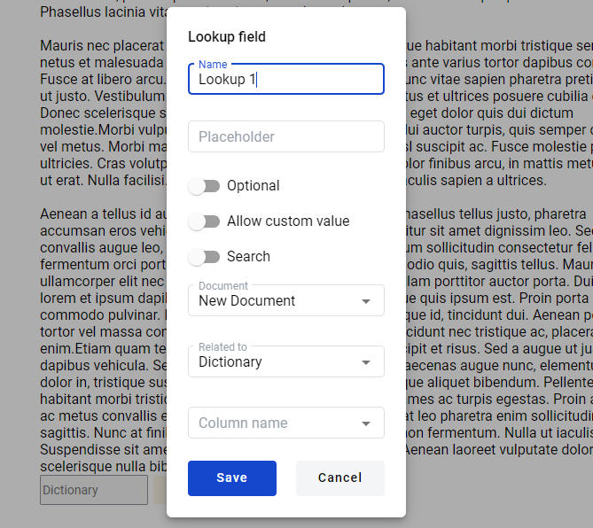
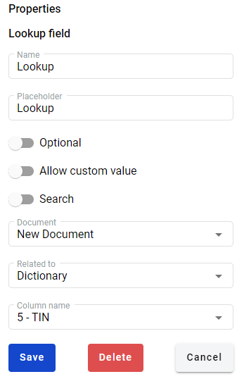

============
Lookup Field
============

.. toctree::

Lookup field automatically pulls a value from related dictionary.

Create Lookup Field
===================

1. Navigate to https://staging.whitedoc.space/template/form/create

2. Drag and drop lookup field to the document (note that at least one dictionary field should be added to the document for you to be able to add lookup fields).

3. Next window should appear:

4. Fill the "Name" attribute of the field (should be unique per document).

5. Fill the "Placeholder" attribute for this field (not mandatory, if you don't fill this field, name will be used as placeholder).

6. Select "Optional" attribute status for this field. If it is enabled value in the field can be left empty (note that if same value for related dictionary is enabled control will be locked in enabled state).

7. Select "Allow custom values" attribute status for this field. If it is enabled value in the field can be modified by hand instead of using only predefined values from dictionary.

8. Select "Search" attribute status for this field. If it is enabled value in the field can be used for envelope search in mailbox.

9. Choose "Document" from the list of documents with dictionaries.

10. Choose dictionary from "Related to" list of dictionaries for this field to refer to.

11. Choose column from "Column name" list of columns for this field to refer to.

12. Click on "Save" will add new lookup field.

Edit Lookup Field
=================

1. Navigate to https://staging.whitedoc.space/template/form/create

2. Click on the lookup field in the document.

3. Edit field form should appear on the right side:

4. Click on "Delete" button will delete field and close edit form.

5. Click on "Cancel" will close edit form.

6. You can change parameters the same way as described in "Create Lookup Field".

7. Click on "Save" will Save all the changes you made and close edit form.

Lookup Field Template
=====================

Lookup field in the document can use dictionary field from any document in template if it is not inside table field.

Lookup Inside Table fields
==========================

Lookup field inside table field can use only dictionary field from the same table or dictionary field from any document in template.
Lookup fields inside table can't use dictionary from other table fields.

Missing Column At Lookup Field
==============================

When lookup field uses dictionary column that was deleted, it becomes invalid with the template itself.
To fix this lookup field needs to be update with new existing column.

No Access To Dictionary
=======================

When dictionary field has no access to dictionary it becomes invalid with all attached lookup fields and the template itself.
To fix this lookup field needs to be update with new existing dictionary and column.

Disabled Lookup Field
=====================

Lookup field can not be added to document if no dictionary fields are added there prior to this.

Deleting Dictionary Field
=========================

Dictionary can not be deleted if it has lookup fields attached to it. To delete such dictionary you need to delete or reattach to other dictionary fields all related lookup fields.

Lookup Field in Envelope
========================

Lookup field can not be filled manually unless it has "Allow custom values" attribute enabled. To fill in lookup field, value in related dictionary field should be selected. When value in dictionary is selected all related lookup fields will be automatically filled. If related dictionary is updated before user sends envelope an error message with information about dictionary changes will be shown. If dictionary was deleted all lookup fields which relate to this dictionary field will be highlighted with red. If related Dictionary field has "Allow custom value" attribute enabled - Lookup field inherits this attribute and user will be able add custom data.
