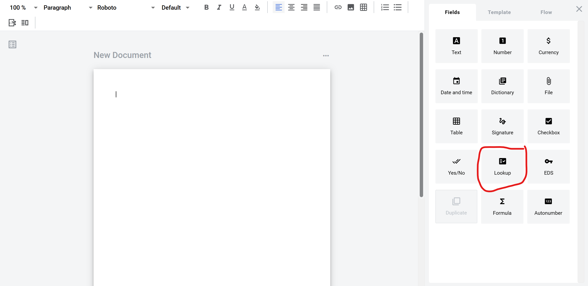

============
Lookup field
============

Lookup field allows you to create an automatically populating field which will return a value from a specified column of a row of parent dictionary field value.

How to add lookup field to template
====================================

1. To add field to structured document, place text cursor where you want field to be added and click its button (alternatively it can be placed via drag & drop)

2. To add field to PDF document, drag & drop it to desired place in the document. It can be moved around and resized by lower left corner afterwards

.. image:: pic_lookup/lookupPDF.png
   :width: 600
   :align: center

3. Field creation form will appear, where you should set field attributes

.. image:: pic_lookup/lookupModal.png
   :width: 600
   :align: center

4. Name - this is a name of a field
5. Placeholder - this text will be shown in the input box before anything is filled in (can be left empty, field name will be used instead)
6. Optional - this attribute specifies if this field is mandatory to fill
7. Allow custom values - this attribute specifies if field will allow free text input besides automatic population

.. note:: If dictionary has optionality or custom values attributes enabled, same attributes will also be enforced on all related lookups.

8. Search - this attribute specifies if this field should be eligible for mailbox page search
9. Document - dropdown selector of a document, where desired parent dictionary is located
10. Related to - dropdown selector of a desired parent dictionary
11. Column name - dropdown selector of a desired column in a parent dictionary

When all attributes are set, you can click Save button and field will be added. You can click field to see its properties and update them. Also you can delete the field in same menu.

.. image:: pic_lookup/lookupStructured.png
   :width: 600
   :align: center