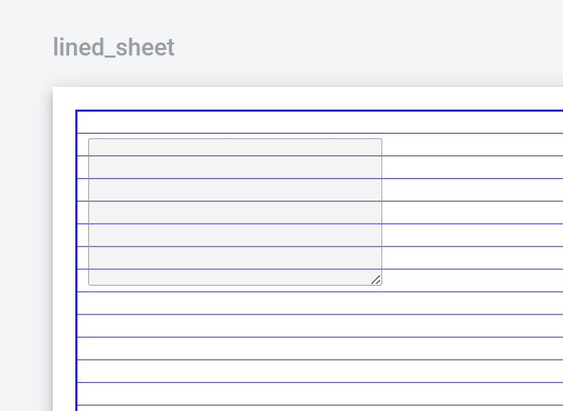
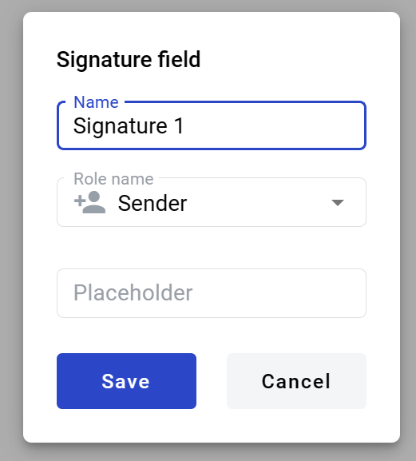
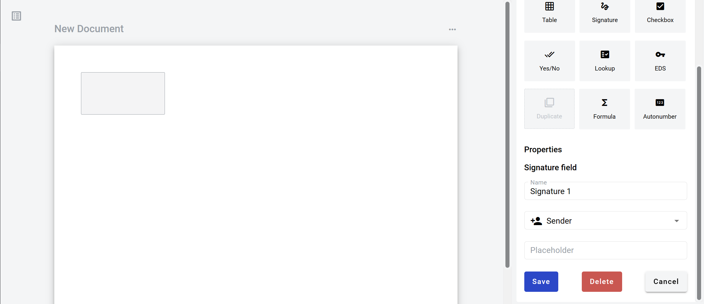
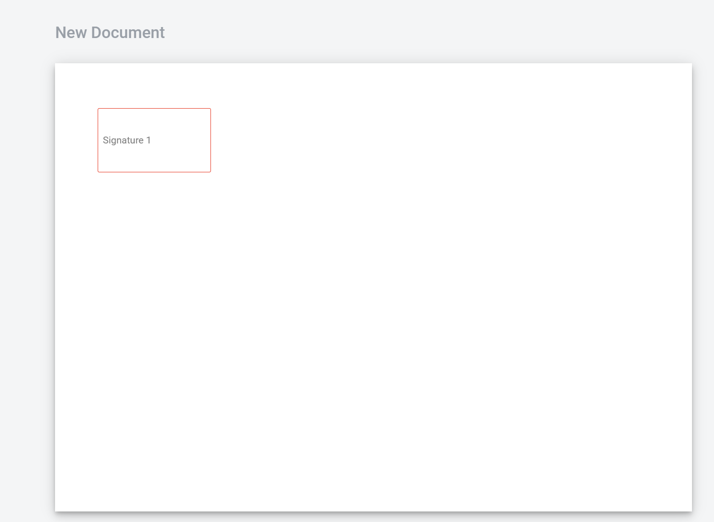
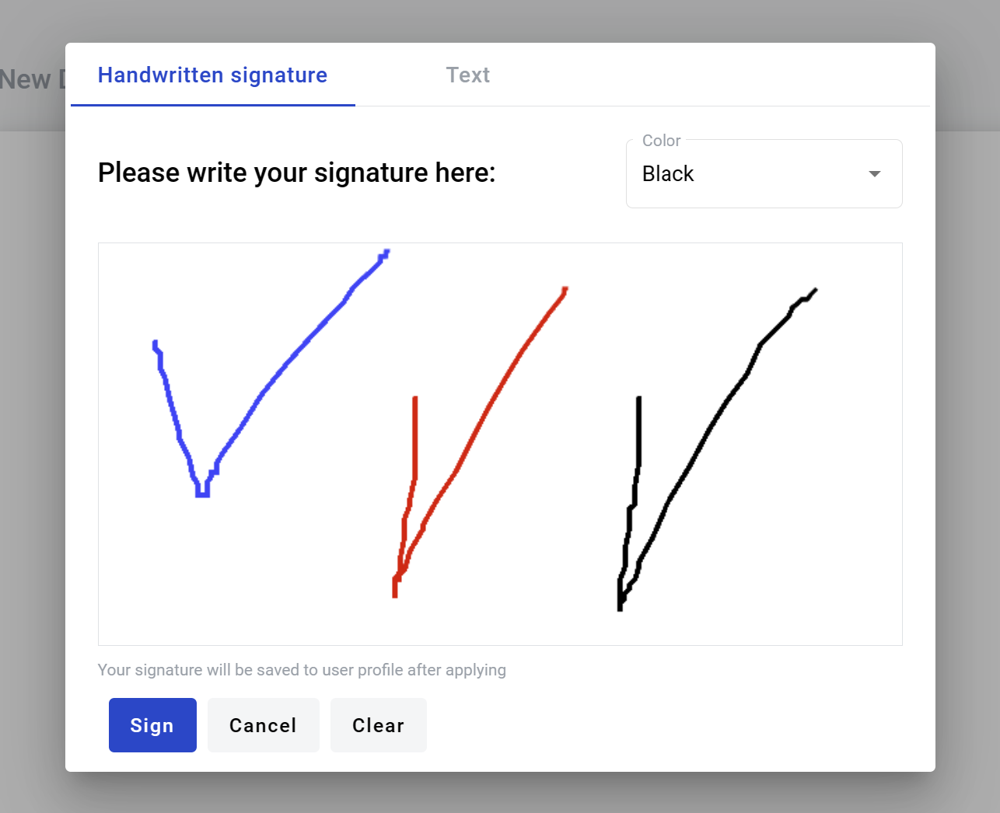

===============
Signature field
===============

Signature field allows user to place e-ink signature on a document. It can be added to structured and PDF documents.

How to add signature field to template
======================================

1. To add field to structured document, place text cursor where you want field to be added and click its button (alternatively it can be placed via drag & drop)

.. image:: pic_signature/signatureIcon.png
   :width: 600
   :align: center

2. To add field to PDF document, drag & drop it to desired place in the document. It can be moved around and resized by lower left corner afterwards

3. Field creation form will appear, where you should set field attributes

4. Name - this is a name of a field
5. Role name - this is a role which will be assgined to fill this field
6. Placeholder - this text will be shown in the text box before anything is filled in (can be left empty, field name will be used instead)

When all attributes are set, you can click Save button and field will be added. You can click field to see its properties and update them. Also you can delete the field in same menu.

Filling signature field
=======================

1. Open envelope where signature field is located
2. Click on signature field

3. Window will appear

.. image:: pic_signature/signatureDraw.png
   :width: 600
   :align: center

.. note:: If you have saved e-ink signature in your profile settings page, window will not open and signature will be automatically applied.

4. Draw your signature on the empty area by pressing left side on the mouse and dragging it around. You have to draw at least 0.5 sec to complete validation of the field. Note that you can change color or input text instead of drawing on Text tab

5. You can reset drawing area with "Clear" button
6. Click "Sign" to insert your signature to the field (can't be empty)
7. After clicking "Save" you will see your signature in the document

.. image:: pic_signature/documentSigned.png
   :width: 600
   :align: center

8. Signature can be changed by clicking on the picture of your signature and repeating steps 2, 3 and 5