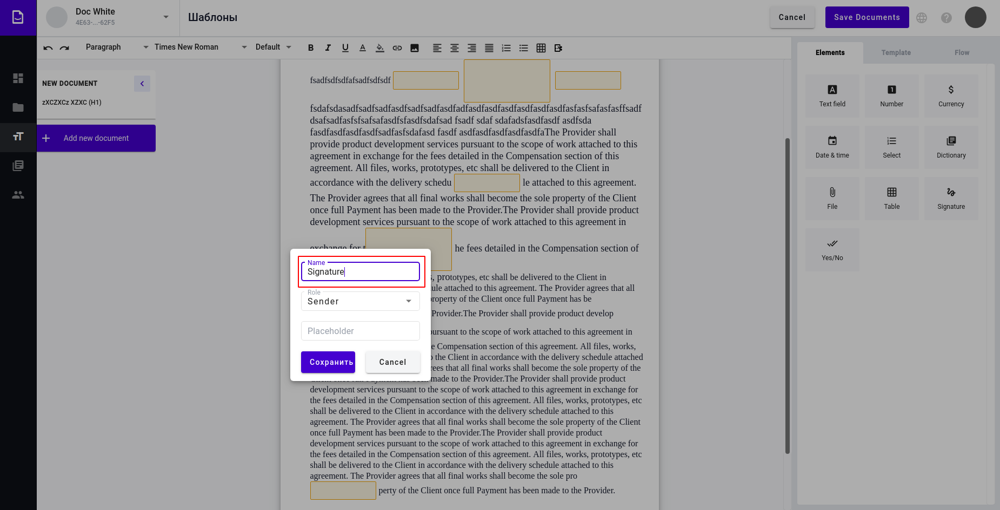

===============
Signature field
===============

.. toctree::

Signature field allows user to place e-ink signature on a document. It can be added to structured and PDF documents.

How to add signature field to template
======================================

1. You can click on Signature field in fields menu to add it to place where text cursor is positioned in structured document. To do so make sure that cursor is placed there

.. image:: pic_signature/signatureIcon.png
   :width: 600
   :align: center

2. Field creation form will appear

.. image:: pic_signature/signatureModal.png
   :width: 600
   :align: center

3. Alternatively you can drag and drop field to desired place in the document. In such way it can be also added to uploaded PDF documents in template. In such documents it can also be resized by dragging bottom right corner

.. image:: pic_signature/signaturePDF.png
   :width: 600
   :align: center

.. note::
   If added to PDF document, signature field can also be moved around by drag and drop.

4. Fill the name of the field (should be unique per document)

5. Choose Role to fill this field by clicking on "Role" input (default role is Sender)

.. image:: pic_signature/sign-field-form-role.png
   :width: 600
   :align: center

6. Choose Role from the list by clickin on role name

.. image:: pic_signature/sign-field-form-role-select.png
   :width: 600
   :align: center

7. Fill the placeholder for this field (optional, if left empty field name will be used)

.. image:: pic_signature/sign-field-form-placeholder.png
   :width: 600
   :align: center

8. Click save

.. image:: pic_signature/sign-field-form-save.png
   :width: 600
   :align: center

9. Field should be added now

.. image:: pic_signature/sign-field-added.png
   :width: 600
   :align: center

Editing signature field
=======================

1. Click on the signature field in the document

.. image:: pic_signature/sign-field-added.png
   :width: 600
   :align: center

3. Field properties should appear on the right side

.. image:: pic_signature/sign-field-edit-form.png
   :width: 600
   :align: center

4. Clicking on "Delete" button will delete field and close edit form

.. image:: pic_signature/sign-field-edit-form-delete.png
   :width: 600
   :align: center

5. Here you can change field properties

.. image:: pic_signature/sign-field-edit-form-fields.png
   :width: 600
   :align: center

7. Click on "Save" will Save all the changes you mad and close edit form

.. image:: pic_signature/sign-field-edit-form-save.png
   :width: 600
   :align: center

Filling signature field
=======================

1. Open envelope where signature field is located

.. image:: pic_signature/envelope-editor.png
   :width: 600
   :align: center

2. Click on signature field

.. image:: pic_signature/envelope-signature.png
   :width: 600
   :align: center

2. Window will appear

.. image:: pic_signature/envelope-signature-popup.png
   :width: 600
   :align: center

.. note::
   If you have saved e-ink signature in your profile settings page, window will not open and signature will be automatically applied.

3. Draw your signature on the empty area by pressing left side on the mouse and dragging it around. You have to draw at least 0.5 sec to complete validation of the field

.. image:: pic_signature/envelope-signature-popup-signing.png
   :width: 600
   :align: center

4. Click on "Clear" button to reset draw area

.. image:: pic_signature/envelope-signature-popup-clear.png
   :width: 600
   :align: center

5. Click "Sign" to insert your signature to the field (can't be empty)

.. image:: pic_signature/envelope-signature-popup-save.png
   :width: 600
   :align: center

6. Click "Cancel" to close popup without changes

.. image:: pic_signature/envelope-signature-popup-cancel.png
   :width: 600
   :align: center

7. After clicking "Save" you will see your signature in the document

.. image:: pic_signature/envelope-signature-ready.png
   :width: 600
   :align: center

8. Signature edited (you will have to draw it from star) by clicking on the picture of your signature and repeating steps 2, 3 and 5