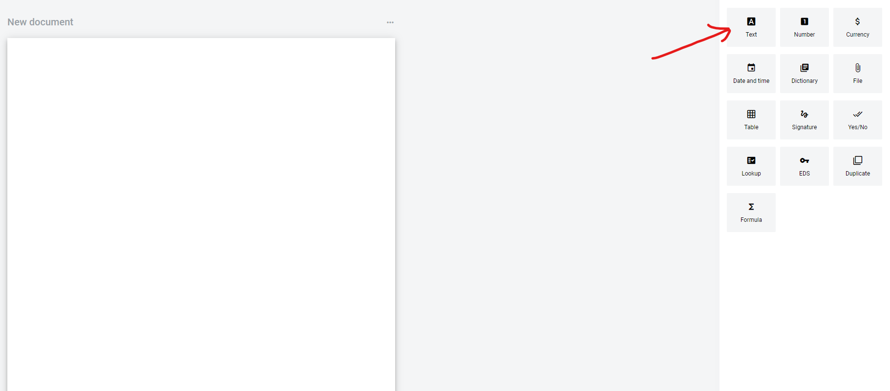
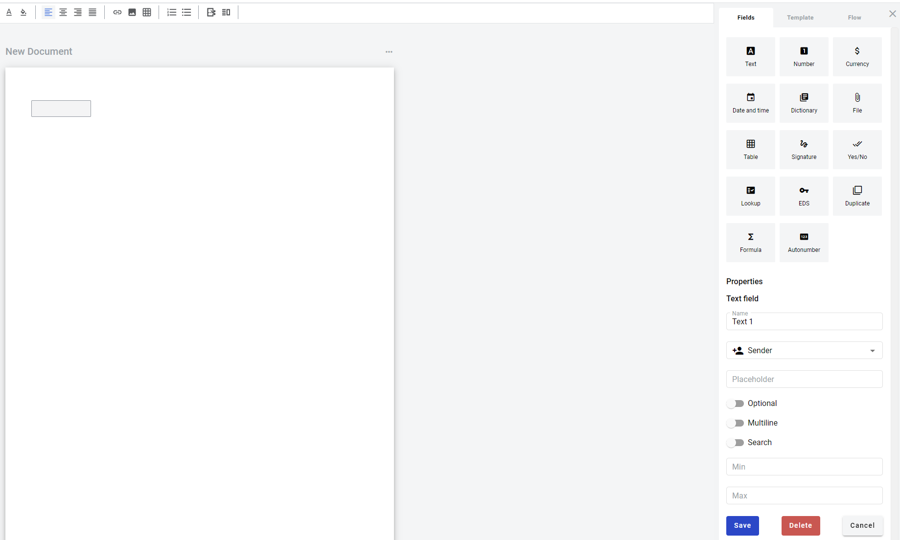

==========
Text field
==========

.. toctree::

Text field allows you to create dynamic text box which will be filled by participants of the envelope processing flow.

To add text field you should place a cursor in the document and click on Text field button, or drag it over the document.

Modal window with properties of the field will appear.

.. image:: pic_text/TextAttributes.png
   :width: 400
   :align: center

1. Name - this is a name of a field

2. Role name - this is a role which will be assgined to fill this field

3. Placeholder - this text will be shown in the text box before anything is filled in (can be left empty)

4. Optional - this attribute specifies if this field is mandatory to fill

5. Multiline - this attribute specifies is this text field will be single or multi lined

.. note::
   Please note that standart character limit is 1000 for singleline filed and 5000 for multiline field

6. Search - this attribute specifies if this field should be eligible for mailbox page search

7. Min - minimum number of characters required for field (no limit is applied if left empty)

8. Max - maximum number of characters required for field (standart limit is applied if left empty)

When attributres are set you can click Save button and field will be added. You can click filed to see its properties and update them. Also you can delete the field in same menu.

