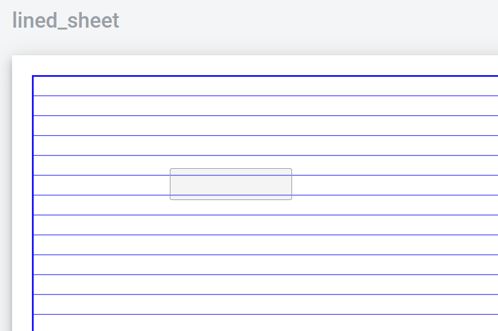
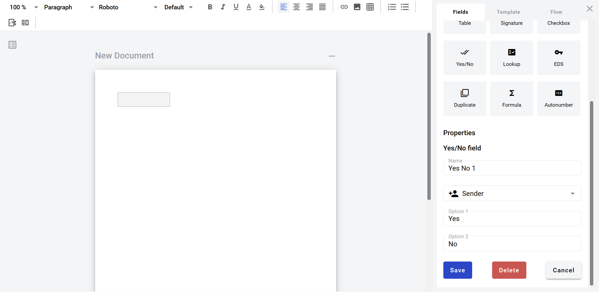

============
Yes/No field
============

Yes/no is a field which allows you to create a selection of two predefined values. You can customize default "Yes" and "No" options. It looks like button with two options of "Yes" and "No" values. After selection the value of the button will be changed to regular text with selected value.

How to add yes/no field to the document
=======================================

1. To add field to structured document, place text cursor where you want field to be added and click its button (alternatively it can be placed via drag & drop)

.. image:: pic_yesno/yesnoIcon.png
   :width: 600
   :align: center

2. To add field to PDF document, drag & drop it to desired place in the document. It can be moved around and resized by lower left corner afterwards

3. Field creation form will appear, where you should set field attributes

.. image:: pic_yesno/yesnoModal.png
   :width: 600
   :align: center

4. Name - this is a name of a field
5. Role name - this is a role which will be assgined to fill this field
6. Option 1 - first option available for selection
7. Option 2 - second option available for selection

When all attributes are set, you can click Save button and field will be added. You can click field to see its properties and update them. Also you can delete the field in same menu.

