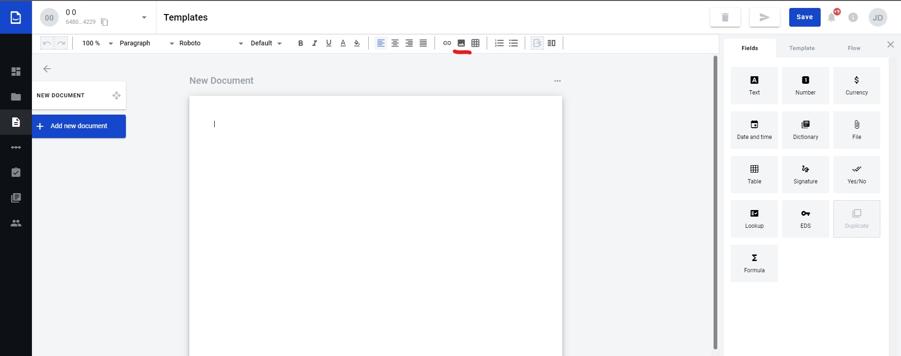
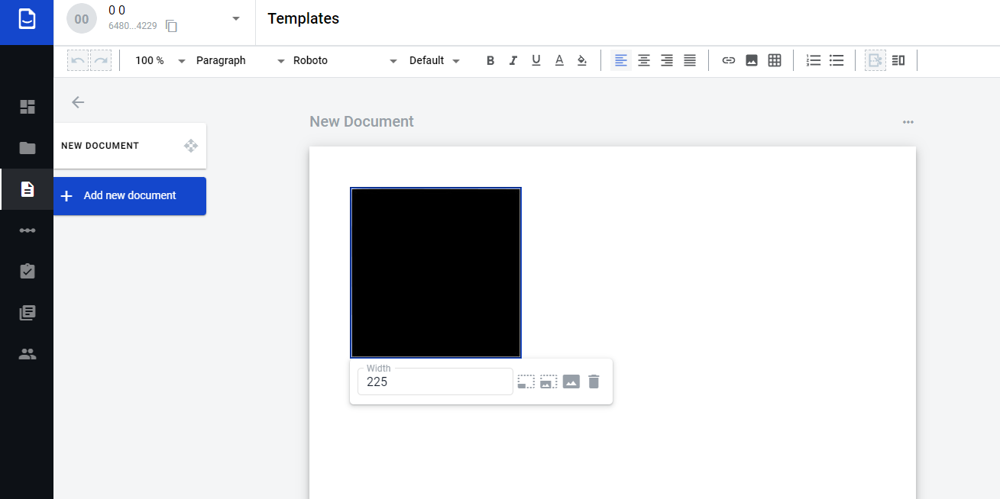

.. _addImageTemplate:

======================
Images inside document
======================

.. toctree::

How to add image to document
============================

1. Open document for edition
2. Set focus on document body (it's necessary to understand where exactly we have to add image)
3. Click on image icon in the editor header menu

4. Select file in folder manager (allowed files extensions are .png, .jpg, .jpeg) and confirm
5. Image added to document to the place where cursor was

Image properties edition
========================

1. To do that click on image and set image width using special image size input

2. Select one of the default sizes (25%, 50% or 100% of the uploaded image size)

.. warning:: Maximum size of the image which can be displayed on the document is 618px. So, if you upload image with size 1024x768 px it will be automatically decreased to 618 px with saving proportions.

* You can set positioning for image using default positioning tool of editor.
* You can't add image to table (static or dynamic).

How to delete image?
====================

1. Click on image and click on delete icon in the menu

.. image:: pic_imagesInsideTemplate/removeImgBtn.png
   :width: 400
   :align: center

2. Set cursor of mouse behind the image and click "Backspace" button on Windows or Linux or "Delete" button on Mac
3. Set cursor of mouse in front of the image and click "Delete" button

Restriction related to image sizes
==================================

According ot document structure we have restrictions for image size and resolution.

* You can't upload image with size more than 5 MB.
* You can't upload image with resolution bigger than 1024x768 px.