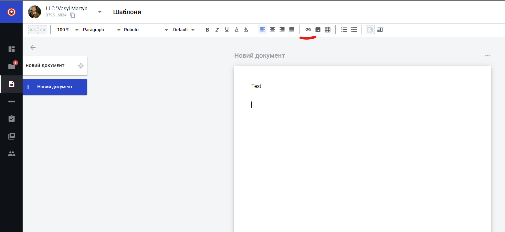
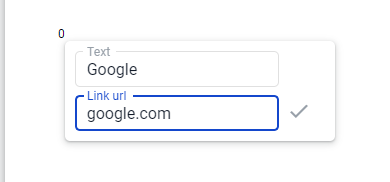
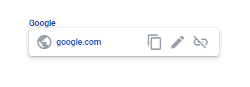

.. _addLinkTemplate:

=====================
Links inside document
=====================

.. toctree::

You can create hyperlinks inside your structured documents. To do so follow next steps:

1. Put a cursor inside the document where you want to add it and click Link button

   
2. Modal window will open allowing you to enter title (optional) and target for your link

   
.. note:: You can also select static text in the document and click Link button to create a link from text. Make sure to select only static text, because any dynamic fields selected for link creation will be romoved from the document.
   
3. To edit existing links yo can click on any link and click Edit (also you can copy and remove link by according buttons)

