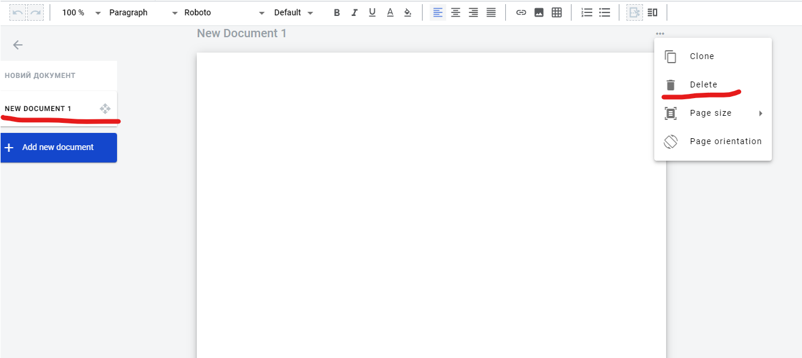
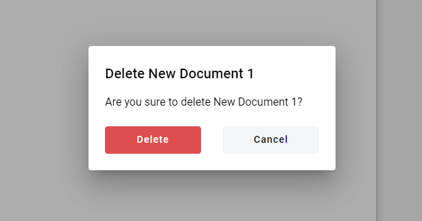
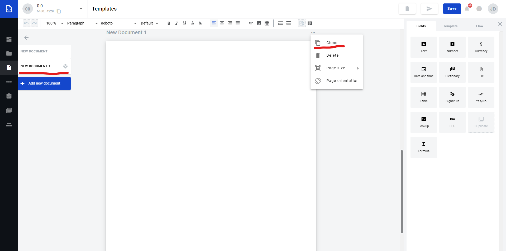

===================
Structured document
===================

Structured document is a document which you can fill in with static (simple text, tables, images and links) and dynamic
data (fields). Static data does not change from envelope to envelope, when dynamic data can be modified.

Structured document is added by default within template creation action but you can easily add new structured documents to template.

How to add a structured document?
=================================

1. Open document management menu

.. image:: pic_addDocument/openDocumentsMenu.png
   :width: 400
   :align: center

2. Click on "Add new document" button

.. image:: pic_addDocument/addDocumentOption.png
   :width: 400
   :align: center

3. Select option "Structured" in menu

.. image:: pic_addDocument/structuredDocumentOption.png
   :width: 400
   :align: center

4. New structured document added to template. Now you can fill data, add fields, tables to document

How to delete a structured document?
====================================

1. Navigate to needed document

2. Expand the menu near the document and click Delete

   
3. Confirm deletion in pop-up window

How to clone a structured document?
===================================

1. Navigate to needed document

2. Expand the menu near the document and click Clone

**Content list**

.. toctree::

    linksInsideDocument/linksInsideDocument.rst
    imagesInsideDocument/imagesInsideDocument.rst
    tablesInsideDocument/tablesInsideDocument.rst
    fields/fields.rst