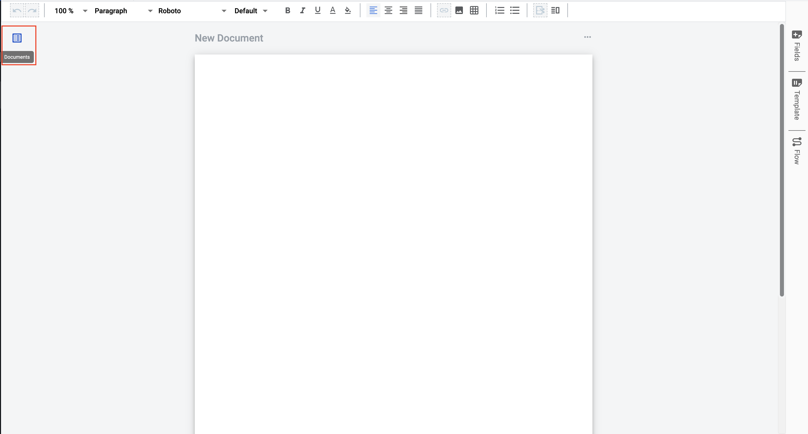
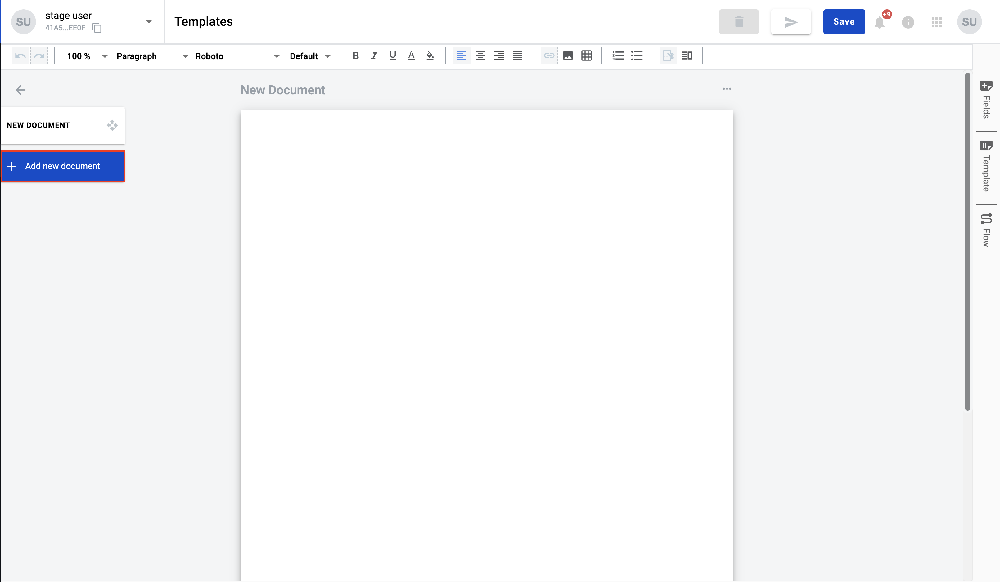
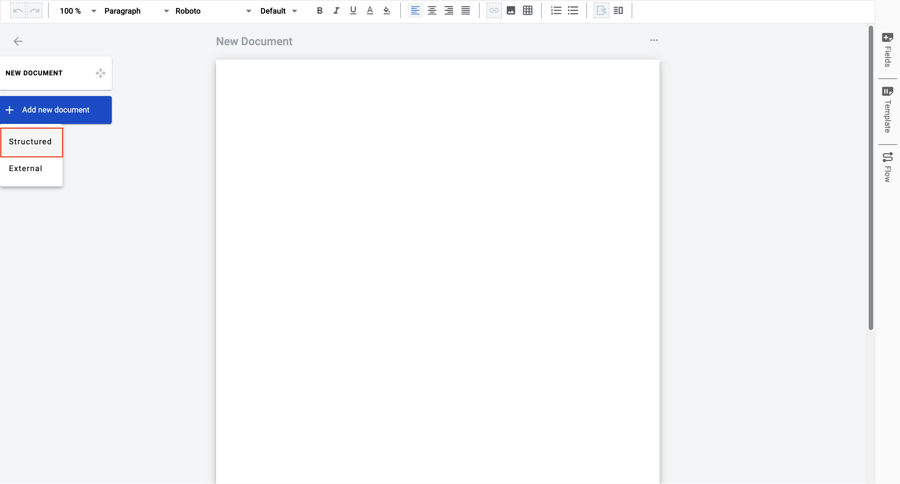

===================
Structured document
===================

Structured document is a document which you can fill in with static (simple text, tables, image and etc.) and dynamic
data (fields). Static data is not change from envelope to envelope, when dynamic data changes.

Structured document is added by default within template creation action but you can easily add new one structured
document to template.

How to add structured document?
===============================

1. Open document management menu

2. Click on "Add new document" button

3. Select option "Structured" in menu

4. New structured document added to template. Now you can fill data, add fields, tables to document

How to delete structured document?
==================================

documentation in progress...

How to clone structured document?
=================================

documentation in progress...

---------------------------------

**Content list**

.. toctree::

    imagesInsideDocument/imagesInsideDocument.rst
    tablesInsideDocument/tablesInsideDocument.rst
    fields/fields.rst
