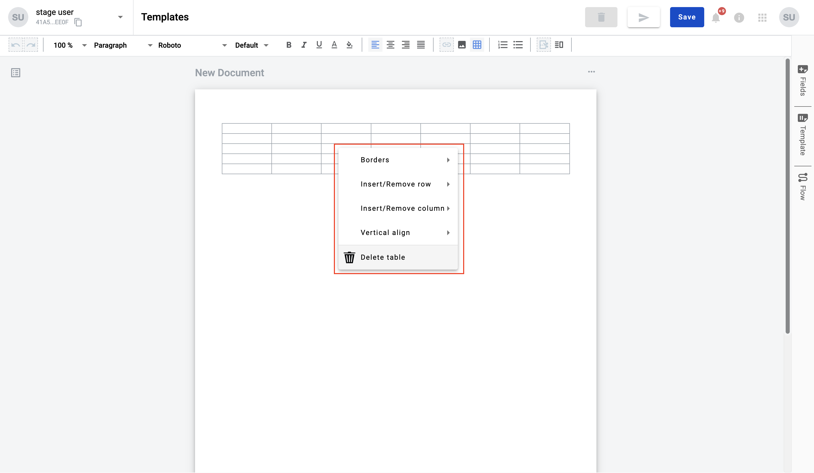
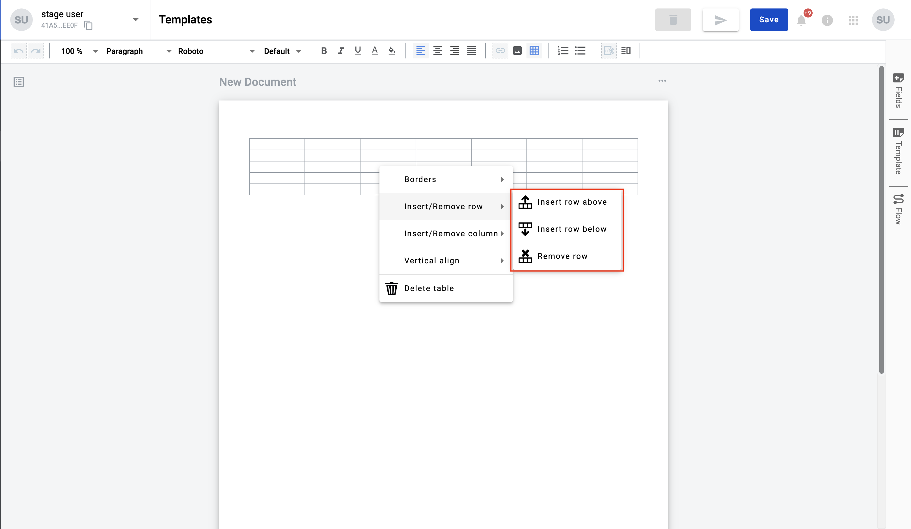
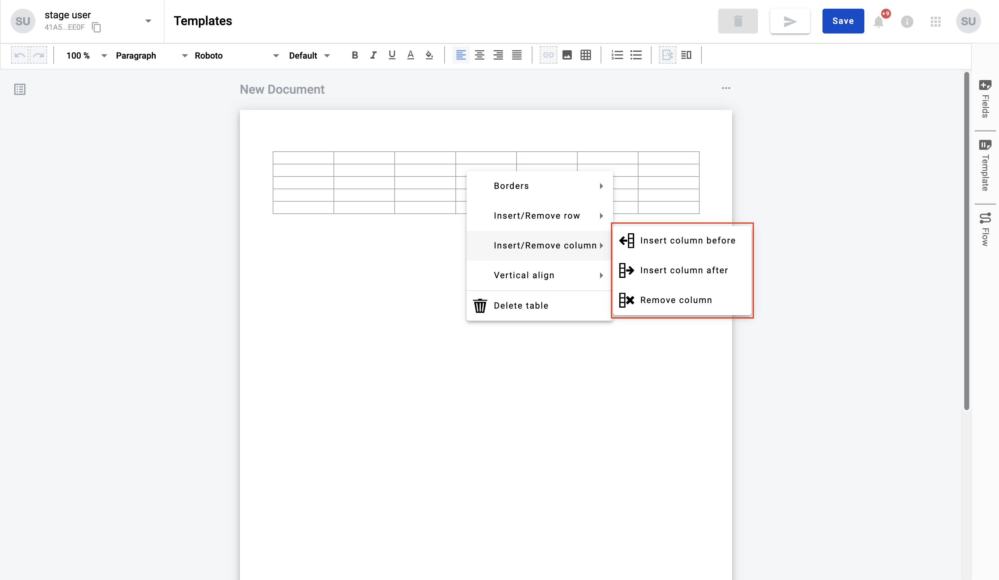
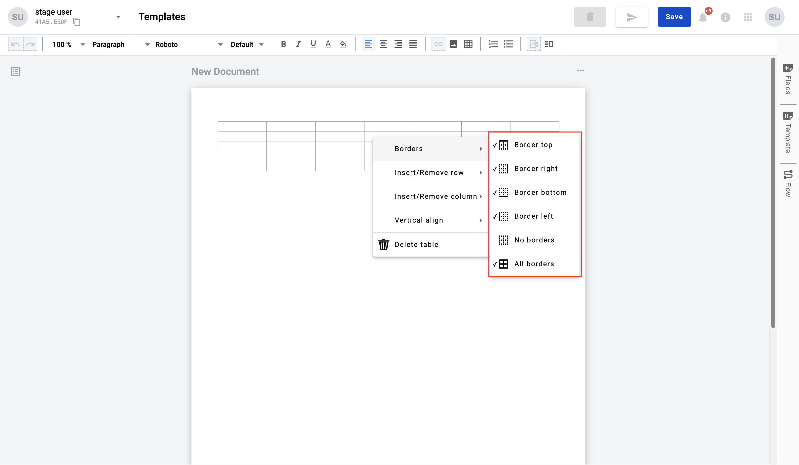
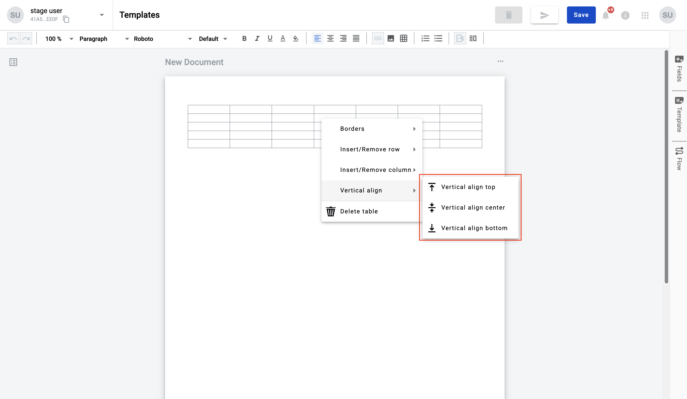

.. _tableContextMenu:

.. toctree::

==========================
Table context menu options
==========================

Table context menu contains actions to manage column/rows quantity, borders visibility, cell content alignment and you
can delete table. To open context menu click on respective cell or cells right mouse button

Manage columns/rows
===================

You can select section inside context menu. Sections "Insert/Remove row" and "Insert/Remove column" we'll observe below

**Insert row above** - action add row above row you clicked on when open context menu

**Insert row below** - action add row below row you clicked on when open context menu

**Remove row** - action remove you clicked on when open context menu

**Insert column before** - action add column before column you clicked on when open context menu

**Insert column after** - action add column after column you clicked on when open context menu

**Remove column** - action add remove column you clicked on when open context menu

Adjust borders visibility
=========================

You can adjust borders visibility through respective option in context menu. Borders visibility can be adjusted for
single table cell or for group of cells

**Border top** - hide or show top border of the cell or cells group

**Border right** - hide or show right border of the cell or cells group

**Border left** - hide or show left border of the cell or cells group

**Border bottom** - hide or show bottom border of the cell or cells group

**No borders** - hide or show all borders of the cell or cells group

**All borders** - show or hide all borders of the cell or cells group

Vertical align of content inside cell
=====================================

You can apply content vertical align option to table cell or cells

**Vertical align top** - align text inside cell or cells by top

**Vertical align center** - align text inside cell or cells by center

**Vertical align bottom** - align text inside cell or cells by bottom

Delete table
============

Option "Delete table" remove table with all content inside
