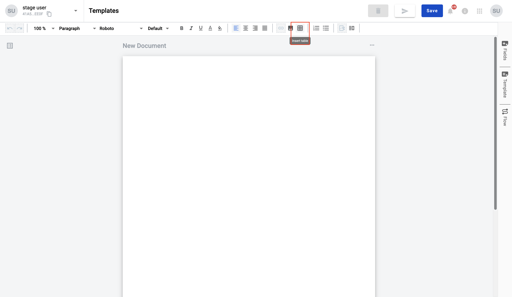
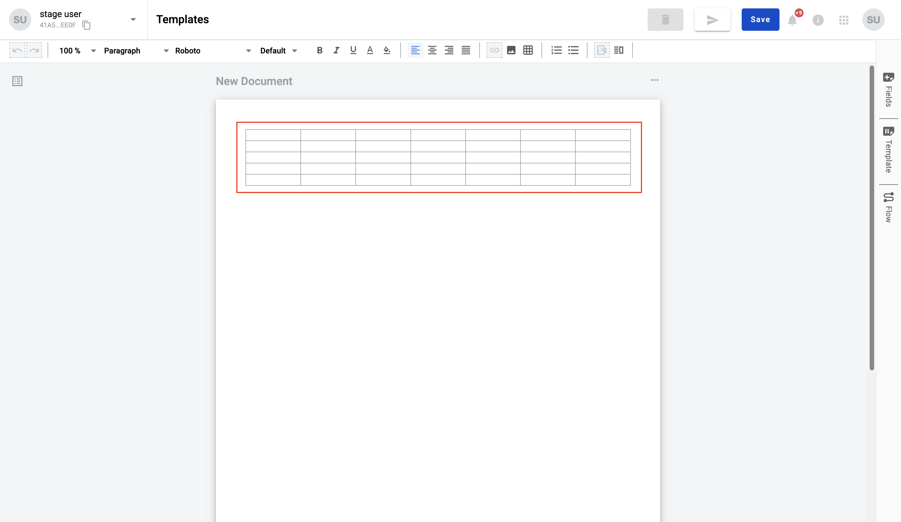
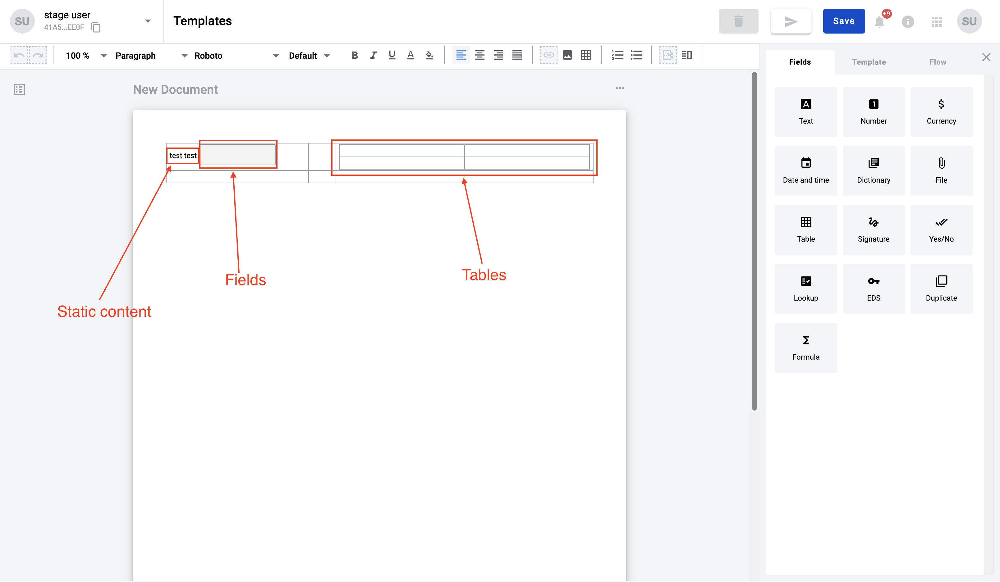

.. _addStaticTable:

=============================
Static tables inside document
=============================

Static table is a table with constant quantity of columns and rows on envelope, but within template you're able to
change it's quantity. Static tables may include text, fields, tables, images inside the cell. Also each cell can be
formatted as you want.

How to add static table to document?
====================================

To add static table to document you can use top menu of the editor panel.

1. Click on table option in menu

2. Select table size you want to add (max table size by default is 10x10 cells)

.. image:: pic_tablesInsideDocument/tableSize.png
   :width: 400
   :align: center

3. Table added to document and all columns has similar size

What can you do with tables?
============================

* You can fill in table with static content, dynamic content and tables:

* You can change column width. To do that hover on cell border, click and hold pointer and drag border in the side you need to expand column

* You can change style inside cell. Select data or click in the cell and select any style option

* You can add columns, add rows, hide/show borders and apply vertical align for cell. How to do that described in :ref:`table context menu <tableContextMenu>`

* You can select several cells to manage them

---------------------------------

**Content list**

.. toctree::

    tableContextMenuFunctionality/tableContextMenu.rst
