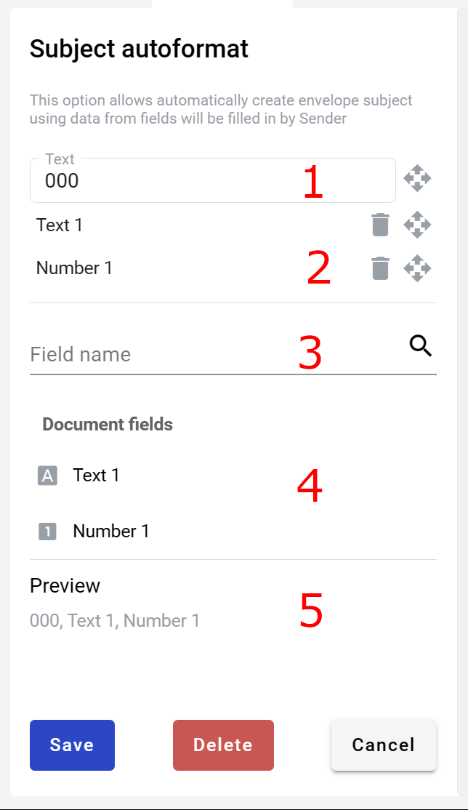

.. _autoSubject:

==================
Subject autoformat
==================

Envelope subject can be configured to contain data from dynamic fields in the envelope. Please note that it means that envelope subject will change during envelope processing flow steps, if fields assigned to role other then sender are used in the subject.

How to configure subject autoformat?
====================================

1. Click on subject configuration icon, form will open

2. Enter required prefix text (3 characters minimum) (1)
3. Add fields to subject by clicking on their names in the list of available fields (4)
4. You can used search box to narrow the list (3)
5. Fields can be removed from subject by trash bin icon in added fields list (2)
6. Pay attention to the preview (5) - it shows example of how subject will look (field values are separated by comma and space)
7. Click Save button in the form footer to save your autosubject settings. Do not forget to click Save button in template editor (near your user picture) aswell, otherwise your cahnges will not be saved
8. You can delete autosubject settings by Delete button in form footer. Once again, do not forget to save template afterwards