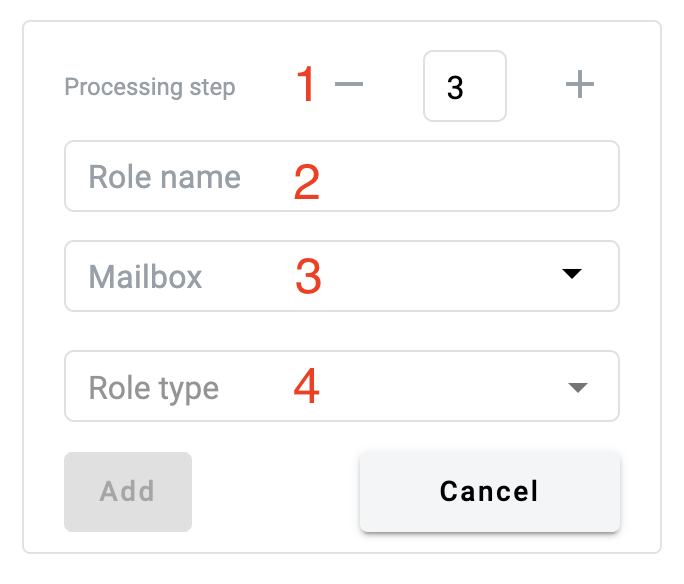
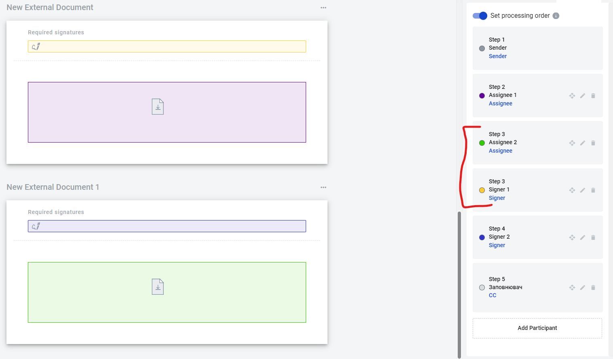

.. _processing-flow:

================================
What is envelope processing flow
================================

Processing flow is an order in which envelope will be received by all recepients. You can configure in what sequence recipients will get an envelope with it. There are three types of the sequences: parallel, consistent and serial-parallel

1. Parallel flow is an AUTO mode of the flow when system make configuration of the flow by scripted rules and participants of flow receive envelope parallel and according to the role type
2. Consistent flow is a MANUAL mode of the flow. To enable it click on "Set ordering process" toggle and configure roles according to your requirements to the flow
3. Serial-parallel flow is also a MANUAL mode but with a couple of roles with similar order

Role configuration interface
============================

Role configuration interface for AUTO flow contain the following information:

1. Role order — order of the role in the list (available only if "Set ordering process" toggle is enabled)
2. Role name — name which will be displayed to the user in the template and envelopes. It is a mandatory field
3. Role mailbox — mailbox of the role to which envelope will be sent. If set on template level, it's impossible to change it on envelope level later

.. note:: You can specify exact mailbox or restrict mailbox selection to contacts only on envelope level in this field. Also names of every role including Sender can be changed to any text value up to 40 characters max.

4. Role type — type of role and according to the type user will be obligated to make some actions in envelope. There are 4 types of roles available:

Assignee role
=============

Assignee is a role which has to fill in fields in envelope or sign document electronic signature if necessary. Assignee role has to have at least one field in at least one document of the template. Order of the assignee role in the flow should be lower than order of a Signer role.

Signer role
===========

EDS signer role is a role which has to sign document with Advanced or Qualified electronic signature. Signer role has to have at least one EDS field in at least one document of the template. EDS signer role can't have two EDS fields for one document. Order of the Signer role in the flow should be greater than order of assignee.

Approver role
=============

Approver role can approve or reject envelope movement to next roles. Approver role can be set at any place of the processing flow, but not earlier than Sender.

CC role
=======

CC role just receive copy of envelope and can't edit fields in the document. CC role can be set at any place of the processing flow, but not earlier than Sender.

AUTO flow
=========

In AUTO flow system configure processing flow by the following rules:

1. Assignee is added after Sender or last Assignee (if Assignee has been already added to the flow) and before EDS Signer
2. EDS signer is added after Assignee (if Assignee has been already added to the flow) and before first CC (if CC has been already added to the flow). EDS Signer is added after Sender if Assignee role was not added
3. CC is added after last EDS Signer (if EDS Signer has been already added to the flow) or after last Assignee (if Assignee has been already added to the flow and EDS Singer was not added), or after Sender if no role except Sender was added

MANUAL flow
===========

Logic of addition roles to the flow similar to AUTO flow, but user can change the order. To change the order user has to enable "Set ordering process" toggle and set order using drag and drop option for roles or edit order number of each role manually. For example you can create a flow where signer role can be before assignee role in case when assignee has no actions in current document of the template and has to upload other documents.

Some restrictions of the role places in the flow:

1. Assignee cannot have order in the flow higher than first EDS Signer
2. EDS signer cannot have order lower than last Assignee
3. Copy can have any order in the flow but not less than 1

.. warning:: If you have an external documets with e-ink signatures in your template you will have to place document uploader roles before roles which are signing these documents in MANUAL mode.

Serial-parallel flow
====================

It is a flow similar to Consistent flow where you can create multiple roles with same processing order.

Some restrictions of the role places in the flow:

1. Assignee cannot have order in the flow higher than first EDS Signer
2. EDS signer cannot have order lower than last Assignee
3. Copy can have any order in the flow but not less than 1

.. warning:: If you have an external documets with e-ink signatures in your template you will have to place document uploader roles before roles which are signing these documents in MANUAL mode.