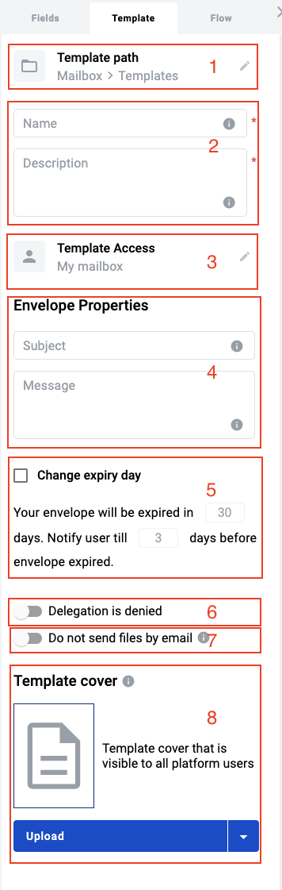

========================================
How to create, edit and manage template?
========================================

.. toctree::

Template it's an entity of the platform which can contain one or more documents inside and using template customers can create envelopes.

How to create template?
=======================

To create template you have to follow to the next steps:

1. Open template list

2. Click on button "New template"

3. Fill in obligatory fields as Template subject and message within right side bar menu "Template"

4. Configure processing flow of the template. How to configure processing flow and what is it you can find by the :ref:`link <processing-flow>`

5. Add fields to document or create new one documents according to the role in the flow to the document

6. Click on "Save" button to save template on platform

How to edit template?
=====================

If you want to add some changes to template or documents inside template you have to do the following:

1. Open template list

2. Click on template options icon against template you want to edit

3. Select "Edit" option from the list to open template configuration form

Now you can make you changes. To save you changes click on button "Save" on the template editor page.

.. _templatePropertyTemplate:

Right side bar menu "Template"
==============================

On template configuration page we are able to set some template properties, such as template name, description, access level and more.

On screenshot below you can find template properties description

1. Template path. This property allow you configure template storing location across your mailbox

2. Template name and description. Name and description are properties with respective meaning

3. Template access level. Property which allows you set access level of the template according to your needs. Detailed about access level :ref:`here <templateAccessLevel>`

4. Envelope properties. Properties, such as Subject and Message of envelope. Allow you predefine respective properties. If properties set on template it's impossible to change them when creating envelope

5. Envelope expiration property. Property allows you to configure expiration period of envelopes which will be created from template. If property set on template it's impossible to change it when creating envelope

6. Envelope delegation property. Property denies or allows delegation of the actions with envelope. If property set on template it's impossible to change it when creating envelope

7. Envelope sending and sharing emails property. Property denies or allows possibility to attach documents to envelope completion email or possibility to share envelope. If property set on template it's impossible to change it when creating envelope

8. Template cover. Preview of the template will be displayed for you and other mailboxes which have access to template. Available option upload custom image or set default image
