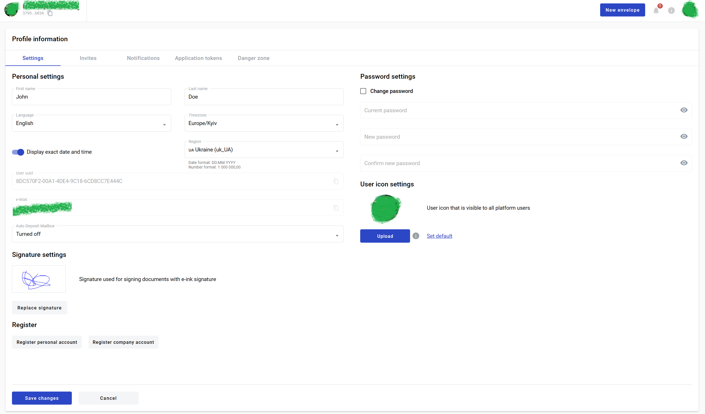
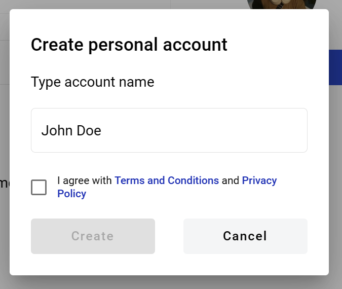
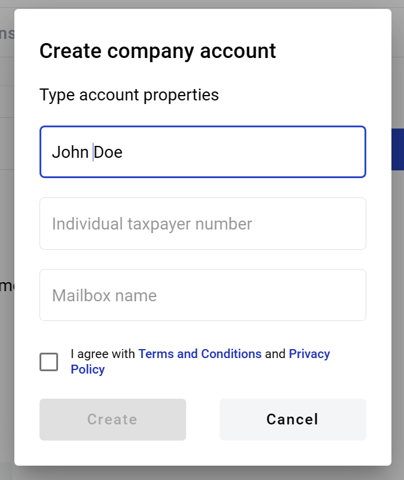
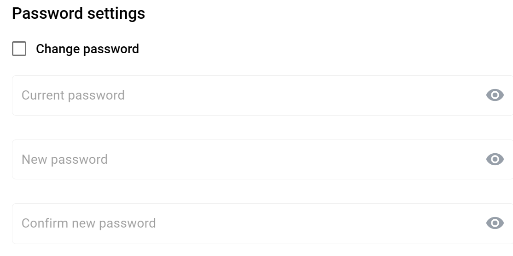
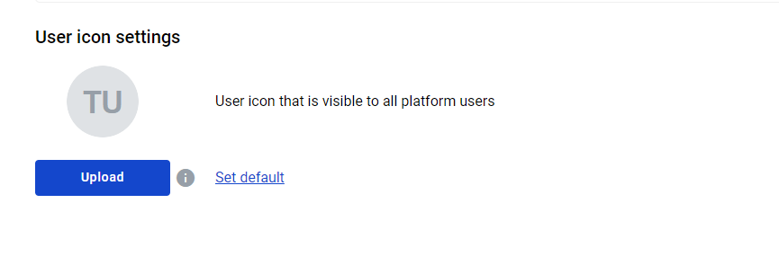
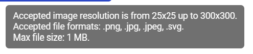
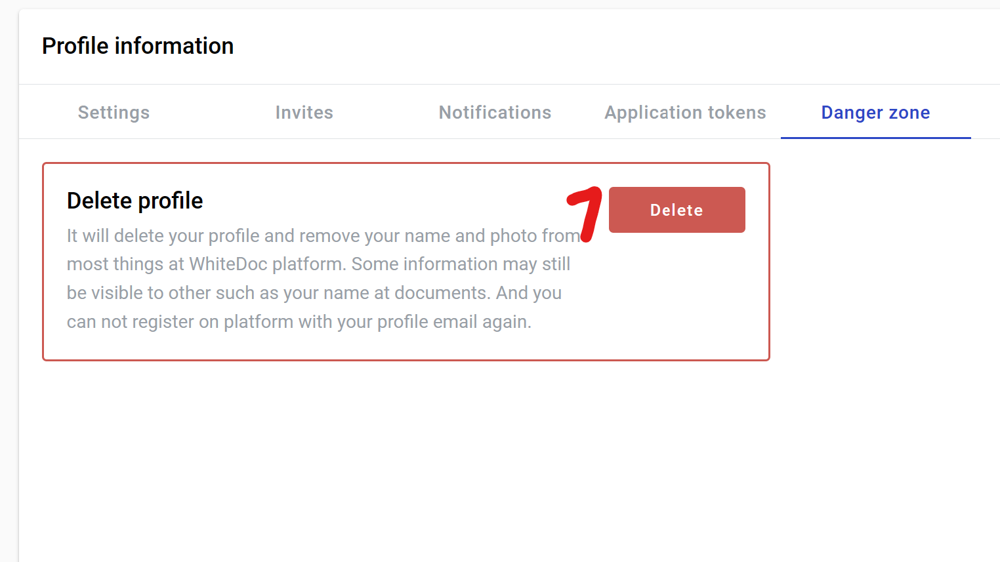
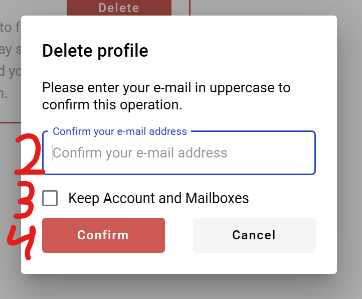
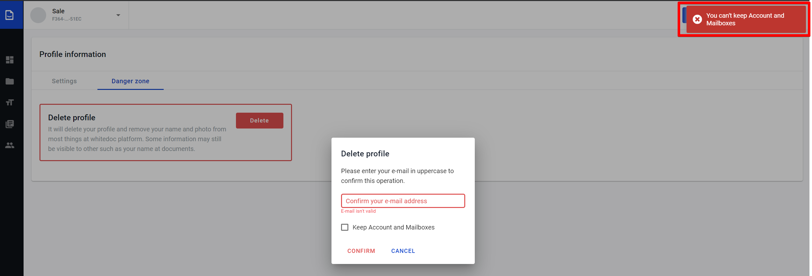

============
User profile
============

This page allows you to edit various settings of your user profile. To open user profile page navigate to https://platform_address/profile

============
Settings tab
============

1. First name
2. Last name
3. Language - this is language which will be used in user interface
4. Timezone - choose your time zone
5. Display exact date - specifies if absolute (01.01.2023 12:12) or relative (fiwe minutes ago) time is used
6. Region - specifies regional formats for dates and number, example is shown below the menu
7. User UUID (can not be changed, only copied)
8. Email (can not be changed, only copied)
9. Auto deposit mailbox - specifies which mailbox will be used for incoming envelopes. If disabled - you will have to manually specify mailbox for each incoming envelope.
10. Signature settings - here you can create or update tour e-ink signature
11. Register personal account
12. Register company account

Do not forget to click on Save changes button after editing anything on this page

Personal account registration
=============================

1. To register new personal account click on Register personal account button
2. In opened window enter a name for the account
3. Select checkbox "I agree with Terms and conditions and Privacy policy"
4. Click on Create button (button will be enable when previous steps are done)

Company account registration
============================

1. To register new personal account click on Register company account button
2. In opened window enter a name, ITN and mailbox name for the account
3. Select checkbox "I agree with Terms and conditions and Privacy policy"
4. Click on Create button (button will be enable when previous steps are done)

Creating and applying an electronic ink signature
=================================================

1. Go to user profile page
2. Click on Replace signature button
3. Draw your signature
4. Alternatively, text can be used as signature
5. Click on Save changes button on the account setting page

Password updating
=================

1. Check Change password checkbox
2. Enter current password
3. Enter new password
4. Confirm new password in second field
5. Click on Save changes button

User icon upload
================

1. Click Upload button and select an image
2. To see allowe image formats and size hover over info icon

3. Click Save changes button to apply new icon
4. You can return default profile logo with Set default link

===============
Danger zone tab
===============

This page allows you to delete your user account. To open user profile page navigate to https://platform_address/profile?activeTab=dangerzone

	
.. note:: Ability to remove own user profile can be restricted in instance settings. In such case there will be no Danger zone tab on Profile information page.

1. After User profile deletion all Accounts with role "Account owner" will be deleted with all related data.
2. User can keep all Accounts and all data which related to these accounts after User profile deletion.

**Delete User profile, Accounts and all related data**

1. Click on (1)Delete button
2. Enter the e-Mail in upper case to the field (2) in the modal window which opens after click on “Delete” button
3. Click on button (4)Confirm for confirm decision to delete user profile, Accounts and Mailboxes
4. After deletion user profile you will be logout and redirected to login page

**Delete User profile, keep Accounts and all related data**

1. Before delete user profile you should assign a new account owner to all accounts where you have this role(Account owner)
2. After that you should go to Danger zone tab in user profile page and click on (1)Delete button
3. Enter the e-Mail in upper case to the field (2) in the modal window which opens after click on “Delete” button
4. Select checkbox (3) Keep Account and Mailboxes
5.  Click on button (4)Confirm for confirm decision to delete user profile
6. If all Accounts where you have role "Account owner" has other owners your profile will be deleted, you will logout and redirected to login page, otherwise you will observe error message in the right corner of the page

.. note:: `Behaviour of data after deleting a user profile <delete_userProfile_behaviour.html>`_

---------------------------------

**Content list**

.. toctree::

   invitationManagement/invitationManagement.rst
   delete_userProfile_behaviour.rst
   addLogo.rst