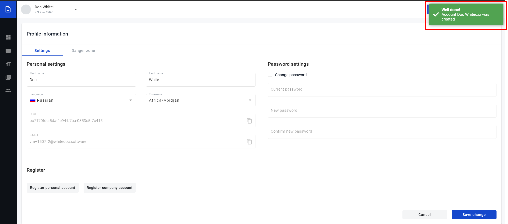
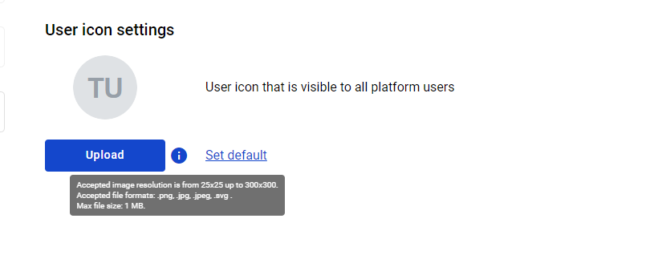
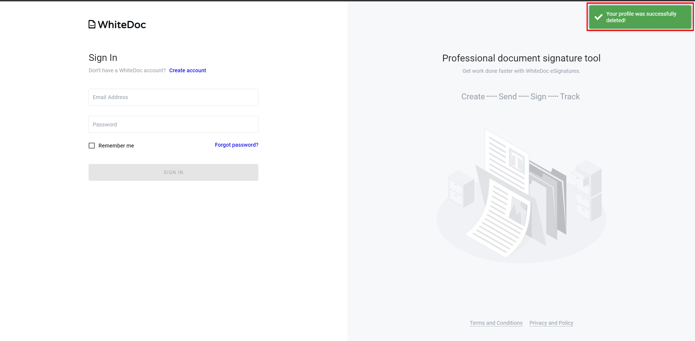

============
User profile
============

.. toctree::

   invitationManagement/invtitationManagement.rst
   delete_userProfile_behaviour.rst

---------

**User profile** page allows:

1. Update profile settings.
2. Register personal accounts.
3. Register company accounts.
4. Add logo for user profile
5. Delete profile.
6. Creating and applying an electronic ink signature

To open user profile page navigate to https://staging.whitedoc.space/profile .

On **Settings** tab you can edit (1) First name/(2) Last name, (3) change language, (4) change timezone, (7) change password,
start process for (8)register personal account, start process for (9)register company account. Fields (5) Profile UUID, (6) e-Mail not editable.

.. image:: pic_userprofile/tabSettings.png
   :width: 600
   :align: center

On **Danger zone** tab you can start process for (1) delete user profile.

.. image:: pic_userprofile/tabDangerZone.png
   :width: 600
   :align: center

Edit profile settings
=======================
1. To start edit (1) First name/(2) Last name, just focus on necessary field which you want to edit, make changes in this field and
click on "Save change" button.

.. image:: pic_userprofile/editName.png
   :width: 600
   :align: center

2. To change password need select checkbox(1) otherwise fields (2), (3), (4) will be unavailable. After checkbox (1) selected
input current password in field (2), new password input in field(3) for confirm new password repeat input new password in field (3).
If all input data correct button (5)Save change will be available and you can confirm change password to click on this button.

.. image:: pic_userprofile/changePassword.png
   :width: 600
   :align: center

If password successfully changed the notification message will show at the right corner of the page.

.. image:: pic_userprofile/changePasswordSuccess.png
   :width: 600
   :align: center

3. To change language click on field (1)Language, after that will be open drop down menu where you can select language which supported our system.
For confirm this changes click on (2)Save change button.

.. image:: pic_userprofile/changeLanguage.png
   :width: 600
   :align: center

4. To change timezone click on field (1)Timezone, after that will be open drop down menu where you can select interested you timezone.
For confirm this changes click on (2)Save change button.

.. image:: pic_userprofile/changeTimezone.png
   :width: 600
   :align: center

5. To copy the (1)Profile UUID or (2)e-Mail click on button (3)Copy.

.. image:: pic_userprofile/copyData.png
   :width: 600
   :align: center

If profile successfully edited the notification message will show at the right corner of the page.

.. image:: pic_userprofile/editNameSuccess.png
   :width: 600
   :align: center

Register personal account
=========================
1. To register new personal account click on (1)Register personal account button.
2. Modal window of the personal account creation opens. Enter a name of the Account in field(2).
3. Select checkbox (3)"I agree with Terms and conditions and Privacy policy"
4. Click on the button (4)“Create” (the state of the “Create” button will change after name enters and selected checkbox).

.. image:: pic_userprofile/createPersonalAccount.png
   :width: 600
   :align: center

5.After successful account creation, also created mailbox for this account with same name and in the right corner of the page will show message.

Register company account
========================

1. To register new company account click on (1)Register company account button.
2. Modal window of the personal account creation opens. Enter a name of the Account in field(2).
3. Enter Individual taxpayer number in field (3).
4. Enter a name of the mailbox in field (4).
5. Select checkbox (5)"I agree with Terms and conditions and Privacy policy"
6. Click on the button (6)“Create” (the state of the “Create” button will change after name enters and selected checkbox).

.. image:: pic_userprofile/createCompanyAccount.png
   :width: 600
   :align: center

5.After successful account creation, also created mailbox for this account with same name and in the right corner of the page will show message.

Ability for users upload logos/photos
=====================================

User can add logo for their profile

1. Go to user profile

2. User  view " User icon settings"

.. image:: pic_userprofile/Screenshot_12.png
   :width: 600
   :align: center

3. Click "Upload" button, user can choose any images. User can click the info icon and view params for images

4. User can save image, if click "Save" button

5. You can return default profile logo, when user click "Set default" button. In this case profile logo will consist on first letters of first and  last name

Delete user profile
===================
To delete user profile go to Danger zone tab.
User deletion profile process has two flow.

1. After User profile deletion will be deleted all Accounts where user has role "Account owner" and all data which related to these accounts.

2. User can keep all Accounts and all data which related to these accounts after User profile deletion.

.. image:: pic_userprofile/deleteUserProfile.png
   :width: 600
   :align: center

**Delete User profile, Accounts and all related data**

1. Click on (1)Delete button

2. Enter the e-Mail in upper case to the field (2) in the modal window which opens after click on “Delete” button.

3. Click on button (4)Confirm for confirm decision to delete user profile, Accounts and Mailboxes.

4. After deletion user profile you will be logout and redirected to login page.

**Delete User profile, keep Accounts and all related data**

1. Before delete user profile you should assign a new account owner to all accounts where you have this role(Account owner).

2. After that you should go to Danger zone tab in user profile page and click on (1)Delete button.

3. Enter the e-Mail in upper case to the field (2) in the modal window which opens after click on “Delete” button.

4. Select checkbox (3) Keep Account and Mailboxes.

5.  Click on button (4)Confirm for confirm decision to delete user profile.

6. If all Accounts where you have role "Account owner" has other owners your profile will be deleted, you will logout
and redirected to login page, otherwise you will observe error message in the right corner of the page.

.. image:: pic_userprofile/errorKeepAccount.png
   :width: 600
   :align: center

After successful user profile deletion in the right corner of the page will show message. For repair access to our application
you should register new user.

.. warning:: **Please note!** `Behaviour of data after deleting a user profile <delete_userProfile_behaviour.html>`_

Creating and applying an electronic ink signature
=================================================

1. Go to user profile page
2. You can view "Signature settings"
3. Click "Replace signature" and you have opportunity handwritten signature or input text
4. User can chose font and color for signature
5. After creating signature user must click "Save change" on the account setting page